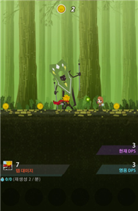
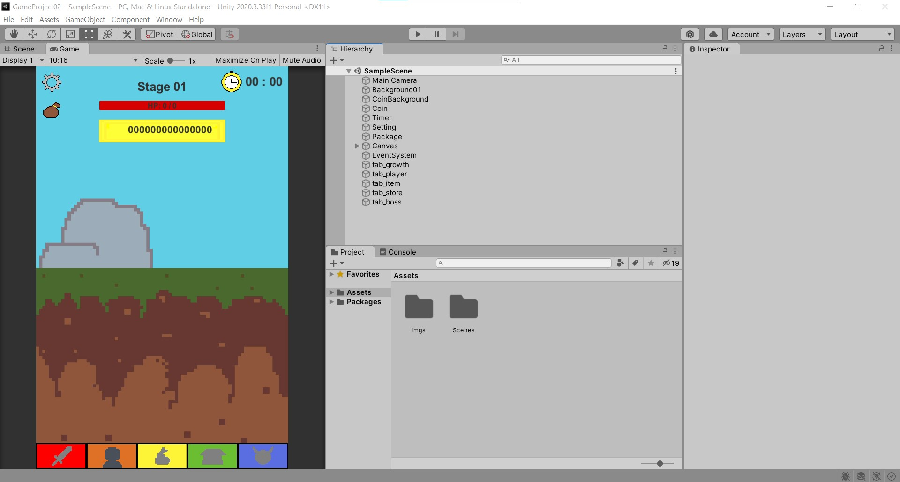

# [게임명: 보스 러쉬(개발자: 장종익)]

## 목차

1. [컨셉](#컨셉)
2. [관련 이미지 & 동영상](#관련-이미지--동영상)
3. [대표 이미지](#대표-이미지)  
4. [컨셉 & 대표 이미지 기반 작품묘사](#컨셉--대표-이미지-기반-작품묘사)  
5. [게임 구성 요소](#게임-구성-요소)  
6. [게임 시스템 디자인](#게임-시스템-디자인)  
7. [요구사항](#요구사항)
8. 키보드 이벤트에 대한 흐름도
9. 스토리보드
10. [프로토타입 개발 요구사항(6주 개발)](#프로토타입-개발-요구사항6주-개발)
11. [프로토타입 개발 작업일정(6주 개발)](#프로토타입-개발-작업일정6주-개발)

  

# [컨셉]

## 메인 컨셉: 성장

- 캐릭터가 성장함에 따라 stage가 증가한다.(치명타 확률이 0%일 때)

### 서브 컨셉 1 : 밸런스

- 캐릭터 성장함에 있어 능력치 분배가 중요한데, 한 능력치가 다른 능력치보다 월등하게 좋으면 대부분의 플레이어가 그 능력치만 성장하기에 각각의 능력치 증가 효율을 비슷하게 만든다.

### 서브 컨셉 2 : 선택

- 성장이 가능한 캐릭터 능력치 중에 선택하여 성장한다.

### 서브 컨셉 3 : 시간제한

- 보스에 시간제한을 두어 일정수준 이상의 성장해야 클리어가 가능하다.

### 서브 컨셉 4 : 보스패턴

- 보스에 패턴을 추가해 클리어에 영향이 가도록 설정한다. 그리고 이 패턴을 플레이어가 막는 방식으로 패턴 막았을 경우 보스에게 영향이 가며, 막지 못했을 경우 클리어 시간이 지연되는 방식이다.

### 서브 컨셉 5 : 아이템

- 보스 패턴을 막는 용도 및 캐릭터 능력치 상승 등 효과를 지닌 아이템을 사용하여 보스를 클리어한다.

  

# [관련 이미지 & 동영상]

[이미지]
- Tap Titans2
- 
  
[동영상]
- https://www.youtube.com/watch?v=bVHayKXTP10

  

# [대표 이미지]

[대표 이미지]
- 

  

# [컨셉 & 대표 이미지 기반 작품묘사]

[대표 이미지 기반]
- 좌측 상단에 순서대로 설정, 스테이지 보상을, 중앙 상단에 순서대로 stage, 적 HP, 보유 중인 재화량을, 우측 상단에는 보스 타이머를 두며, 하단에 탭들(캐릭터탭, 성장탭, 아이템탭, 상점탭, 보스탭)을 둔다.

[컨셉 기반]
- 노말 스테이지에서 적을 쓰러트리고 재화 및 아이템을 얻어 얻은 재화로 성장하여 정해진 시간 내에 보스 스테이지를 클리어한다.

  

# [게임 구성 요소]

## 1. 게임 묘사
- 각기 다른 패턴을 가진 보스를 클리어하는 방치형 게임

 

## 2. 메커니즘

[도전 과제]
- 노말 스테이지를 통해 재화를 모아 캐릭터를 구매 및 성장하라.
- 제한 시간 안에 보스 스테이지의 보스를 물리쳐라.

[재미 요소]
- 노말 스테이지의 적을 물리치면 더 강력한 적이 나온다.
- 성장하여 더 많은 노말 스테이지를 오른다.
- 보스의 패턴을 아이템으로 막는다.

 

## 3. 이야기

[만들게 된 배경]  
- 과거에 했던 방치형 게임이 생각나 이 게임을 리메이크 하고 싶다는 생각이 들어 만들게 되었다.

[참신함]  
- 보스에게 아이템을 사용해 디버프를 부여한다.

[카메라 관점]  
- 카메라 관점은 3인칭으로 제공된다.

 

## 4. 미적요소

[디자인]  
- 배경은 다음 클리어할 보스를 암시한다.

[컬러]  
- 다음 클리어할 보스에 따라 분위기를 다르게 설정한다.

[음향]  
- 노말 스테이지의 배경 음악은 밝은 느낌의 음악으로, 보스 스테이지의 배경 음악은 긴장감 넘치는 음악으로 설정한다.

 

## 5. 기술

- 모바일 용으로 개발한다.

  

# [게임 시스템 디자인]

## 1. 게임 오브젝트 분해

캐릭터  

|연번|오브젝트 이름(영문 이름)|오브젝트 이미지|
|:----:|:----:|:----:|
|1|전사(wrrior)||
|2|궁수(archer)||
|3|공격형_마법사(aggressive_wizard)||
|4|지원형_마법사(utility_wizard)||

 

UI  

|연번|오브젝트 이름(영문 이름)|오브젝트 이미지|
|:----:|:----:|:----:|
|5|스테이지별 배경||
|6|재화(gold)||
|7|가방(package)||
|8|보스_타이머(boss_timer)||
|9|하단탭 - 성장탭, 플레이어탭, 아이템탭, 상점탭, 보스탭(tab_growth, tab_haracter, tab_item, tab_store, tab_boss)||

 

아이템  

|연번|오브젝트 이름(영문 이름)|오브젝트 이미지|
|:----:|:----:|:----:|
|10|폭탄종류 - 빨간색_폭탄, 주황색_폭탄, 노란색_폭탄, 초록색_폭탄, 파란색_폭탄, 남색_폭탄, 보라색_폭탄(boom_red, boom_orange, boom_yellow, boom_green, boom_blue, boom_navy, boom_purple)||
|11|물약1 종류 - 빨간색_물약1, 노란색_물약1, 보라색_물약1(potion1_red, potion1_yellow, potion1_purple)||
|12|물약2 종류 - 분홍색_물약2, 연노란색_물약2(potion2_pink, potion2_lightYellow)||

 

몬스터  

|연번|오브젝트 이름(영문 이름)|오브젝트 이미지|
|:----:|:----:|:----:|
|13|골렘(golem)||
|14|철_골렘(iron_golem)||
|15|미니_슬라임(mini_slime)||
|16|슬라임(slime)||
|17|나비(butterfly)||
|18|몽환나비(dreamy_butterfly)||
|19|사신(grim_reaper)||
|20|데스킹(king_of_death)||

 

## 2. 파라미터(속성) 뽑아 보기

배경  

|속성|영문 명칭|설명|
|:----:|:----:|:----:|
|1번 배경|background1|스테이지1, 던전|
|2번 배경|background2|스테이지2, 늪|
|3번 배경|background3|스테이지3, 초원|
|4번 배경|background4|스테이지4, 묘지|

 

## 3. 행동 뽑아 보기
전사, 궁수, 공격형_마법사  

|행동|영문 명칭|설명|
|:----:|:----:|:----:|
|기본|stand|아무 행동하지 않는 모습|
|공격|attackEnemy|공격주기마다 적에게 피해를 입히는 모습|

 

지원형_마법사  

|행동|영문 명칭|설명|
|:----:|:----:|:----:|
|기본|stand|아무 행동하지 않는 모습|
|정화|removeDebuff|정화주기마다 아군에게 모든 해로운 효과(쇠약 상태 제외)를 제거하는 모습|
|무작위 강화|giveBuff|강화주기마다 아군에게 이로운 효과를 랜덤으로 부여하는 모습|

 

철_골렘  

|행동|영문 명칭|설명|
|:----:|:----:|:----:|
|기본|stand|아무 행동하지 않는 모습|
|방어|defendOneself|자신에게 경감 효과 부여하는 모습|

 

슬라임  

|행동|영문 명칭|설명|
|:----:|:----:|:----:|
|기본|stand|아무 행동하지 않는 모습|
|분열|divideOneself|자신이 여러 개로 분열하는 모습|

 

몽환나비  

|행동|영문 명칭|설명|
|:----:|:----:|:----:|
|기본|stand|아무 행동하지 않는 모습|
|분신 소환|summonOneself|자기 분신을 소환하는 모습|

 

데스킹  

|행동|영문 명칭|설명|
|:----:|:----:|:----:|
|기본|stand|아무 행동하지 않는 모습|
|안개 생성|fogCreation|안개를 생성하는 모습|

 

## 4. 상태 뽑아 보기
물약1 종류 - 빨간색_물약1, 노란색_물약1, 보라색_물약1  

|현상태|전이상태|전이조건|
|:----:|:----:|:----:|
|일반 상태|광기 상태|물약1 사용 시|
|광기 상태|일반 상태|물약1 지속 시간이 지났을 시|

 

물약2 종류 - 분홍색_물약2, 연노란색_물약2  

|현상태|전이상태|전이조건|
|:----:|:----:|:----:|
|일반 상태|광기 상태|물약2 사용시|
|광기 상태|쇠약 상태|광기 상태의 지속시간이 지났을 시|
|쇠약 상태|일반 상태|쇠약 상태의 지속시간이 지났을 시|

 

데스킹  

|현상태|전이상태|전이조건|
|:----:|:----:|:----:|
|일반 상태|즉사 1스택 상태|안개 생성 시|
|즉사 1스택 상태|즉사 2스택 상태|안개 생성 시|
|즉사 2스택 상태|행동 불능 상태(즉사 3스택 상태)|안개 생성 시|

 

## 5. 플레이어 캐릭터 속성(파라미터)

전사, 궁수, 공격형_마법사  

|속성|영문 명칭|설명|
|:----:|:----:|:----:|
|공격력|attack|적에게 입히는 피해량|
|공격주기|attackRate|적을 공격하는 주기|
|공격범위|attackRange|적을 공격할 수 있는 범위|
|치명타확률|criticalProbability|적에게 치명타 공격할 수 있는 확률|
|치명타피해량|criticalDamage|적에게 치명타 공격을 가했을 시 적에게 입히는 피해량|
|상태|state|캐릭터의 상태|

 

지원형_마법사  

|속성|영문 명칭|설명|
|:----:|:----:|:----:|
|정화주기|debuffRate|아군에게 모든 해로운 효과(쇠약 상태 제외)를 제거하는 주기|
|강화주기|buffRate|아군에게 이로운 효과를 랜덤으로 부여하는 주기|
|상태|state|캐릭터의 상태|

 

## 6. 게임의 규칙
- 노말 스테이지
	- 몬스터의 체력이 0이 되면 보상이 주어지며, 이 보상은 가방에 누적
	- 가방을 클릭 시 노말 스테이지에 대한 보상을 받게 되고 노말 스테이지 1단계로 초기화

- 보스 스테이지
	- (승리 시) 보스 체력을 0이 되면 보상이 주어지며, 이 보상은 자동 수령
	- (패배 시) 보스 타이머가 0이 되면 노말 스테이지로 자동 이동

 

## 7. 게임에서 사용될 공식

- 치명타확률 공식
	- 숫자(1~100)를 무작위로 하나 뽑아
		- 치명타확률보다 같거나 높을 경우, 적에게 공격력에 비례한 치명타피해량 만큼 피해를 입힙니다.
		- 치명타확률보다 낮을 경우, 적에게 공격력만큼 피해를 입힙니다.

- 치명타피해량 공식
	- 치명타피해량 = 공격력 * (기본 치명타피해량 + 능력치로 증가된 치명타피해량) * 물약으로 증가된 치명타피해량(%)

- 최종피해량 공식
	- 최종피해량 = 입히는 피해량 - (입히는 피해량 * (경감(%) - 폭탄으로 증가된 피해량(%)))

  

# [요구사항]

- 모든 수치는 확정이 아닙니다.

## 1. 게임 내 화면

- 게임을 실행시키면 시작화면을 출력한다.
- 시작화면에 시작하기, 설정, 게임종료 버튼이 있다.
- 설정에는 밝기 및 소리 조절, 뒤로가기, 게임종료 버튼이 있다.
- 밝기 및 소리의 조절 단계는 5단계다.
- 게임종료 버튼을 누를 경우, 게임이 종료된다.
- 뒤로가기 버튼을 누를 경우, 설정화면이 .
- 시작화면에서 시작하기를 누르면 로딩화면을 출력한다.
- 로딩화면 출력 후 게임화면이 출력한다.
- 게임화면에는 설정, 가이드북, 가방, 스테이지, 몬스터 HP, 재화량, 보스 타이머, 하단탭이 있다.

 

## 2. 튜토리얼 및 스탯에 대한 설명

- 스탯 중 약점 공격 추가 및 몽환나비의 회피율을 추가 고민중...

- 게임을 실행하면 튜토리얼이 자동 실행된다.
- 이 튜토리얼은 게임의 기본적인 방식이나 스토리를 설명한다.
- 이 튜토리얼에 사용될 몬스터는 고블린이다.
- 추가적으로 튜토리얼 클리어 시 소량의 골드를 준다.

- 튜토리얼 설명 순서
	- 1. 노말 스테이지의 적을 처치 시 재화가 가방에 적립!
	- 2. 가방을 클릭 시, 노말 스테이지가 초기화되고, 가방 안에 있는 재화를 획득!
	- 3. 획득한 재화로 성장!
	- 4. 성장한 캐릭터로 보스를 클리어!

- 가이드북
	- 1. 튜토리얼 재설명
	- 2. 몬스터에 대한 정보를 제외하고 모든 것에 대한 설명

- 일반피해량은 흰색 텍스트, 치명타피해량은 노란색 텍스트를 출력한다.

- 경감은 입는 피래량을 감소시킨다.
- 경감의 최소 단계는 0단계이고 최대 단계는 3단계이다.
- 경감 1단계 당 입는 피해량이 5% 감소된다.(최대 15%)

 

## 3. 인게임 시스템(게임화면)
- 좌측 상단에 순서대로 설정, 스테이지 보상을, 중앙 상단에 순서대로 stage, 적 HP, 보유 중인 재화량을, 우측 상단에는 보스 타이머를 두며, 하단에 탭들(캐릭터탭, 성장탭, 아이템탭, 상점탭, 보스탭)을 둔다.
- 노말 스테이지 몬스터를 처치 시 재화를 드랍, 매우 낮은 확률(1%)로 아이템을 드랍한다.
- 노말 스테이지에서 드랍하는 아이템은 모든 종류의 폭탄, 물약1이 드랍된다.
- 보스 스테이지 몬스터를 처치 시 아이템과 재화를 얻는다.
- 보스 스테이지에서 드랍하는 아이템은 난이도에 따라 보상이 달라진다.
- 스테이지가 낮은 단계에선 모든 폭탄, 물약1이 나오고, 높은 단계에선 물약2도 나온다.

- 보스 스테이지를 클리어 성공/실패 시 캐릭터에 존재하는 모든 상태가 풀린다.
- 보스 스테이지에서 노말 스테이지로 이동(전투 퇴장)하는 버튼을 추가한다.
- 보스 스테이지를 어떠한 방법으로든 벗어날 경우, 노말 스테이지로 이동하며 1단계로 초기화된다.
- 보스 스테이지에서는 상점탭과 보스 스테이지 이동탭 사용할 수 없다.
- 보스 스테이지에서 보스가 생성된 후 보스 타이머를 작동한다.

- 하단 탭을 클릭 시 탭에 대한 창이 나온다.
- 성장탭은 캐릭터를 선택하여 성장시킬 수 있다.
- 성장 스텟종류는 공격력, 공격주기, 치명타확률, 치명타피해량이 있다.
- 
- 캐릭터탭은 캐릭터를 고용할 수 있다.
- 아이템탭에서는 자신이 획득한 아이템을 확인 및 사용할 수 있다.
- 상점탭에는 폭탄 및 일부 포션을 구매가 가능하다.
- 보스탭은 원하는 보스를 선택하여 전투를 할 수 있다.

 

## 캐릭터

[캐릭터 정보]  

|캐릭터 종류|공격타입|공격범위|공격대상 수|
|:----:|:----:|:----:|:----:|
|전사|물리공격|근접공격|1명 공격|
|궁수|물리공격|원거리공격|1명 공격|
|공격형_마법사|마법공격|원거리공격|다수 공격|
|지원형_마법사|해당사항 없음|해당사항 없음|해당사항 없음|

 

- 1명 공격하는 캐릭터를 위해 공격 대상 지정한다.

 

[캐릭터 기본 스펙] 

|캐릭터 종류|공격력|공격주기|치명타확률|치명타피해량|
|:----:|:----:|:----:|:----:|:----:|
|전사|200|5초|0%|200%|
|궁수|150|4초|0%|200%|
|공격형_마법사|400|10초|0%|200%|

 

|캐릭터 종류|강화종류 및 강화량|강화주기|지속시간|정화주기|
|:----:|:----:|:----:|:----:|:----:|
|지원형_마법사|공격력 15 증가, 공격주기 3% 감소, 치명타피해량 10% 증가|60초|10초|120초|

 

[캐릭터 고용 비용]  

|캐릭터 종류|고용 비용|
|:----:|:----:|
|전사|해당사항 없음|
|궁수|10,000|
|공격형_마법사|500,000|
|지원형_마법사|10,000,000|

 

[캐릭터 성장 종류 및 수치]  

|캐릭터 종류|공격력|공격주기(최대 60%)|치명타확률(최대 100%)|치명타피해량|
|:----:|:----:|:----:|:----:|:----:|
|전사|4 증가|0.5% 감소|1% 증가|5% 증가|
|궁수|6 증가|0.5% 감소|1% 증가|10% 증가|
|공격형_마법사|10 증가|0.3% 감소|1% 증가|10% 증가|

 

|캐릭터 종류|캐릭터 강화량|강화주기|정화주기|
|:----:|:----:|:----:|:----:|
|지원형_마법사|공격력 1 증가, 공격주기 0.1% 감소, 치명타 피해량 1% 증가|0.5초 감소(최대 20초)|1초 감소(최대 40초)|

 

[캐릭터 성장 소모 비용]  

|캐릭터 종류|공격력|공격주기(최대 60%)|치명타확률(최대 100%)|치명타피해량|
|:----:|:----:|:----:|:----:|:----:|
|전사|40 + 20%|40 + 20%|20 + 20%|40 + 20%|
|궁수|2000 + 20%|2000 + 20%|1000 + 20%|2000 + 20%|
|공격형_ 마법사|4000 + 20%|4000 + 20%|2000 + 20%|4000 + 20%|

 

|캐릭터 종류|강화스킬 증가|강화주기|정화주기|
|:----:|:----:|:----:|:----:|
|지원형_마법사|100000 + 20%|100000 + 20%|100000 + 20%|

 

## 아이템의 종류 및 수치

- 폭탄의 종류
- 재사용 대기시간은 30초다.
- 폭탄 시작위치는 전사 캐릭터 기준이다.
- 도착위치는 바닥에 있는 오브젝트 위치 또는 비행 중인 오브젝트 위치 총 2가지다.
- 폭탄의 궤적을 2차함수 구한다.
- 폭탄은 이동하며 회전한다.  

|폭탄 색상|사용 효과|지속시간|비고|디버프 표시|
|:----:|:----:|:----:|:----:|:----:|
|빨간색|몬스터의 체력 재생 0으로 변경한다.|15초간||표시|
|주황색|몬스터의 받는 피해량 10% 증가한다.|10초간||표시|
|노란색|몬스터를 기절 상태로 만든다.|3초간|모든 공격이 치명타로 들어간다, 비행 중인 몬스터는 추락하며, 보스 패턴이 지연된다.|표시|
|초록색|||||
|파란색|몬스터의 보호막 파괴한다.|||미표시|
|남색|몬스터에게 피해를 입힌다.||공격력에 비례한 피해를 입힌다.|미표시|
|보라색|몬스터을 부식시킨다.||부식은 경감 1단계를 내린다.|미표시|

 

- 물약1 종류
- 물약1, 물약2 중첩 사용 불가능하다.  

|물약1 색상|사용효과|지속시간|
|:----:|:----:|:----:|
|빨간색|공격력 증가|30분|
|노란색|치명타피해량 증가|30분|
|보라색|공격주기 및 스킬주기 감소|30분|

 

- 물약2 종류
- 물약1, 물약2 중첩 사용 불가능하다.
- 1차 사용효과의 지속시간이 지나면 2차 사용효과가 자동으로 발동된다. 

|물약2 색상|1차 사용효과|지속시간|2차 사용효과|지속시간|
|:----:|:----:|:----:|:----:|:----:|
|분홍색|공격력(%) 증가|5분|공격주기 및 스킬주기 증가|5분|
|연노란색|치명타피해량의 (%) 만큼 증가|5분|치명타확률 0%|5분|

 

## 몬스터
- 고블린

- 철_골렘
	- 체력 100% 일 때 경감 3단계
	- 120초 마다 보호막 부여

- 슬라임
	- 체력 재생 효과
	- 체력 0% 이하 시 분열함.

- 몽환나비
	- 비행 오브젝트
	- 체력 50% 이하 시 분신 소환(본체가 죽으면 분신도 죽음)

- 데스킹
	- 즉사 스킬을 사용하는 오브젝트

- 보스5(계획중)
	- 부하를 소환하는 오브젝트

- 보스6(계획중)
	- 외형이 변하는 오브젝트

  

# [프로토타입 개발 요구사항(6주 개발)]

## 1주차

게임화면 UI 제작

- 배경화면
- 설정, 가방, 스테이지, 적 체력, 재화, 타이머
- 하단탭 - 성장탭, 캐릭터탭, 아이템탭, 상점탭, 보스탭
 
## 2주차

게임화면 UI의 버튼과의 상호작용

- 설정에는 밝기 및 소리 조절, 뒤로가기, 게임종료 버튼이 있다.
- 밝기 및 소리의 조절 단계는 5단계다.
- 게임종료 버튼을 누를 경우, 게임이 종료된다.
- 뒤로가기 버튼을 누를 경우, 설정화면이 닫힌다.
- 하단탭을 누를 경우 창이 나온다.

## 3주차

전사 캐릭터, 1 스테이지 노말 몬스터 및 보스 몬스터의 stand 구현

- 전사 캐릭터의 stand 상태 구현한다.
- 1 스테이지 노말 몬스터, 보스 몬스터의 stand 상태 구현한다.
- 보스탭: 선택시 보스 스테이지로 변경한다.

## 4주차

전사 캐릭터 공격 구현 및 1 스테이지 보스 몬스터 패턴 구현

- 전사 캐릭터 공격 구현한다.
- 노말 스테이지 
- 1 스테이지 보스 몬스터인 철 골렘의 방어 패턴 구현한다.
- 보스 몬스터에게 입힌 피해량 표기한다.

## 5주차

하단탭 구현(캐릭터탭 제외)

- 성장탭: 캐릭터 성장 구현한다.
- 아이템탭: 아이템 사용효과 구현한다.
- 상점탭: 아이템 구매 및 판매 구현한다.

## 6주차

각 행동에 따른 사운드 추가

  

# [프로토타입 개발 작업일정(6주 개발)]

## 1주차 작업일정

### 게임화면 UI 제작

- 배경화면(100%)
- 설정, 가방, 스테이지, 적 체력, 재화, 타이머(100%)
- 하단탭 - 성장탭, 캐릭터탭, 아이템탭, 상점탭, 보스탭(100%)

### 제작 결과

 
