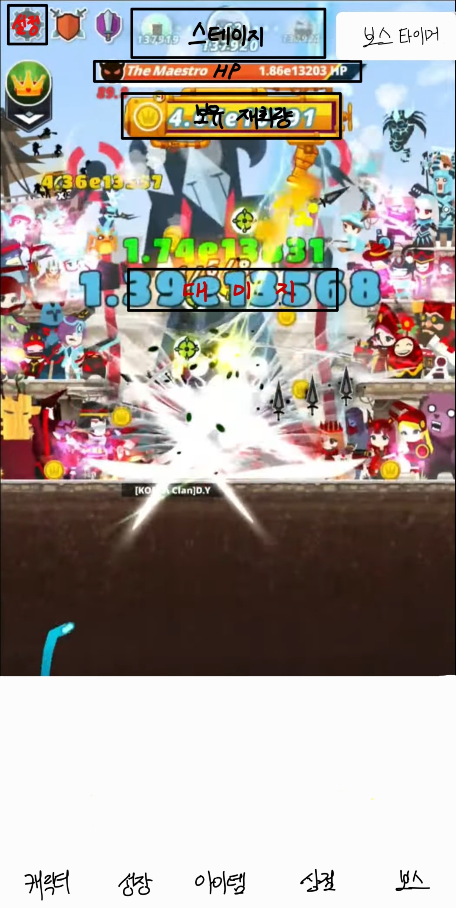

# [게임명: 보스 러쉬(개발자: 장종익)]

## 목차
1. [컨셉](#컨셉)

2. [관련 이미지 & 동영상](#관련-이미지--동영상)

3. [대표 이미지](#대표-이미지)  

4. [컨셉 & 대표 이미지 기반 작품묘사](#컨셉--대표-이미지-기반-작품묘사)  

5. [게임 구성 요소](#게임-구성-요소)  

6. [게임 시스템 디자인](#게임-시스템-디자인)  
    - [a. 게임 오브젝트 분해](#구성-요소-분석)  
    - [b. 파라미터(속성)](#파라미터-뽑기)  
    - [c. 행동](#행동-뽑아보기)  
    - [d. 상태](#상태-뽑아-보기)  
    - [e. 플레이어 캐릭터 속성(파라미터)](#플레이어-캐릭터-속성파라미터)  
    - [f. 게임의 규칙](#게임의-규칙)  
    - [g. 게임에서 사용될 공식](#게임에서-사용될-공식)  

# [컨셉]

## 메인 컨셉 : 성장

- 캐릭터가 성장함에 따라 stage가 증가한다.(치명타 확률이 0%일 때)

### 서브 컨셉 1 : 밸런스

- 캐릭터 성장함에 있어 능력치 분배가 중요한데, 한 능력치가 다른 능력치보다 월등하게 좋으면 대부분의 플레이어가 그 능력치만 성장하기에 각각의 능력치 증가 효율을 비슷하게 만든다.

### 서브 컨셉 2 : 선택

- 성장이 가능한 캐릭터 능력치 중에 선택하여 성장한다.

### 서브 컨셉 3 : 시간제한

- 보스에 시간제한을 두어 일정 수준 이상의 성장해야 클리어가 가능하다.

### 서브 컨셉 4 : 보스패턴

- 보스에 패턴을 추가해 클리어에 영향이 가도록 설정한다. 그리고 이 패턴을 플레이어가 막는 방식으로 패턴 막았을 경우 보스에게 영향(디버프)이 가며, 막지 못했을 경우 클리어 시간이 지연되는 방식이다.

### 서브 컨셉 5 : 아이템

- 보스 패턴 막는 용도 및 캐릭터 능력치 상승 등 효과를 지닌 아이템을 사용하여 보스를 클리어한다.

  

# [관련 이미지 & 동영상]

- 이미지  
  
  
- 동영상
  

  

# [대표 이미지]

  

# [컨셉 & 대표 이미지 기반 작품묘사]

> ### 대표이미지 기반 : 하단에 게임에 중요한 요소들(캐릭터탭, 성장탭, 아이템탭, 상점탭, 보스탭)을, 중앙 상단에 순서대로 stage, HP, 보유 중인 재화량을, 좌측 상단에 순서대로 설정, 스테이지 보상을, 우측 상단에는 보스 타이머를 둘 예정입니다.

> ### 컨셉 기반: 노말 스테이지에서 적을 쓰러트리고 재화 및 아이템을 얻어 재화로 성장하여 정해진 시간 내에 보스 스테이지를 클리어한다.

  

# [게임 구성 요소]

- 다양한 패턴을 가진 보스를 클리어하는 방치형 게임

 

## 1. 메커니즘

[도전 과제]

1. 노말 스테이지를 통해 재화를 모아 캐릭터를 구매 및 성장하라.
2. 제한 시간 안에 보스 스테이지의 보스를 물리쳐라.

[재미 요소]

1. 노말 스테이지의 적을 물리치면 더 강력한 적이 나온다.
2. 성장하여 더 많은 노말 스테이지를 오른다.
3. 보스의 패턴을 아이템으로 막는다.

 

## 2. 이야기

[만들게 된 배경]  
과거에 했던 방치형 게임이 생각나 이 게임을 리메이크 하고 싶다는 생각이 들어 만들게 되었습니다.

[참신함]  
보스에게 아이템을 사용해 디버프를 부여한다. 보스의 패턴은 간단한 미니게임 형식으로 미니게임 클리어 시 보스에게 디버프를 실패 시 플레이어에게 디버프를 부여하는 방식이다.

[카메라 관점]  
카메라 관점은 3인칭으로 제공된다.

 

## 3. 미적요소

[디자인]  
캐릭터는 2D 쯔꾸르 게임에서 사용되는 캐릭터(도트 형식)이다.
배경은 다음 클리어할 보스를 암시한다.

[컬러]  
다음 클리어할 보스에 따라 분위기를 다르게 설정할 예정입니다.

[음향]  
노말 스테이지의 배경 음악은 밝은 느낌의 음악으로, 보스 스테이지의 배경 음악은 긴장감 넘치는 음악으로 설정할 예정입니다.

 

## 4. 기술

모바일용으로 개발할 예정입니다.
