# [게임명: 보스 러쉬(개발자: 장종익)]

## 목차
1. [컨셉](#컨셉)

2. [관련 이미지 & 동영상](#관련-이미지--동영상)

3. [대표 이미지](#대표-이미지)  

4. [컨셉 & 대표 이미지 기반 작품묘사](#컨셉--대표-이미지-기반-작품묘사)  

5. [게임 구성 요소](#게임-구성-요소)  

6. [게임 시스템 디자인](#게임-시스템-디자인)  

7. 요구사항

8. 키보드 이벤트에 대한 흐름도

9. 스토리보드

  

# [컨셉]

## 메인 컨셉: 성장

- 캐릭터가 성장함에 따라 stage가 증가한다.(치명타 확률이 0%일 때)

### 서브 컨셉 1 : 밸런스

- 캐릭터 성장함에 있어 능력치 분배가 중요한데, 한 능력치가 다른 능력치보다 월등하게 좋으면 대부분의 플레이어가 그 능력치만 성장하기에 각각의 능력치 증가 효율을 비슷하게 만든다.

### 서브 컨셉 2 : 선택

- 성장이 가능한 캐릭터 능력치 중에 선택하여 성장한다.

### 서브 컨셉 3 : 시간제한

- 보스에 시간제한을 두어 일정 수준 이상의 성장해야 클리어가 가능하다.

### 서브 컨셉 4 : 보스패턴

- 보스에 패턴을 추가해 클리어에 영향이 가도록 설정한다. 그리고 이 패턴을 플레이어가 막는 방식으로 패턴 막았을 경우 보스에게 영향이 가며, 막지 못했을 경우 클리어 시간이 지연되는 방식이다.

### 서브 컨셉 5 : 아이템

- 보스 패턴을 막는 용도 및 캐릭터 능력치 상승 등 효과를 지닌 아이템을 사용하여 보스를 클리어한다.

  

# [관련 이미지 & 동영상]

- 이미지
    - 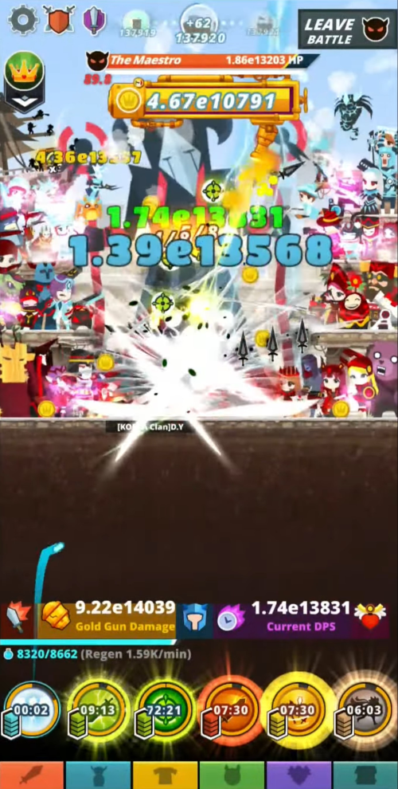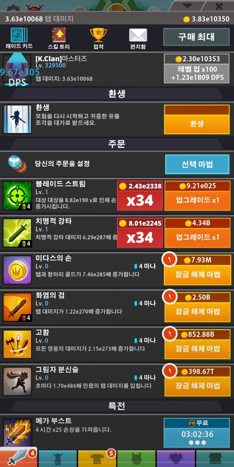
  
- 동영상
    - https://www.youtube.com/watch?v=bVHayKXTP10

  

# [대표 이미지]

- 대표 이미지
    - 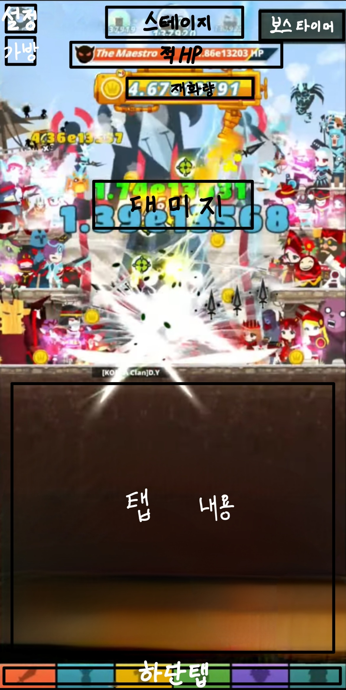

  

# [컨셉 & 대표 이미지 기반 작품묘사]

## 대표 이미지 기반
- 좌측 상단에 순서대로 설정, 스테이지 보상을, 중앙 상단에 순서대로 stage, 적 HP, 보유 중인 재화량을, 우측 상단에는 보스 타이머를 두며, 하단에 탭들(캐릭터탭, 성장탭, 아이템탭, 상점탭, 보스탭)을 둔다.

## 컨셉 기반
- 노말 스테이지에서 적을 쓰러트리고 재화 및 아이템을 얻어 얻은 재화로 성장하여 정해진 시간 내에 보스 스테이지를 클리어한다.

  

# [게임 구성 요소]

## 1. 게임 묘사

- 다양한 패턴을 가진 보스를 클리어하는 방치형 게임

 

## 2. 메커니즘

[도전 과제]

- 노말 스테이지를 통해 재화를 모아 캐릭터를 구매 및 성장하라.
- 제한 시간 안에 보스 스테이지의 보스를 물리쳐라.

[재미 요소]

- 노말 스테이지의 적을 물리치면 더 강력한 적이 나온다.
- 성장하여 더 많은 노말 스테이지를 오른다.
- 보스의 패턴을 아이템으로 막는다.

 

## 3. 이야기

[만들게 된 배경]  
- 과거에 했던 방치형 게임이 생각나 이 게임을 리메이크 하고 싶다는 생각이 들어 만들게 되었다.

[참신함]  
- 보스에게 아이템을 사용해 디버프를 부여한다. 보스의 패턴은 간단한 미니게임 형식으로 미니게임 클리어 시 보스에게 디버프를 실패 시 플레이어에게 디버프를 부여하는 방식이다.

[카메라 관점]  
- 카메라 관점은 3인칭으로 제공된다.

 

## 4. 미적요소

[디자인]  
- 배경은 다음 클리어할 보스를 암시한다.

[컬러]  
- 다음 클리어할 보스에 따라 분위기를 다르게 설정한다.

[음향]  
- 노말 스테이지의 배경 음악은 밝은 느낌의 음악으로, 보스 스테이지의 배경 음악은 긴장감 넘치는 음악으로 설정한다.

 

## 5. 기술

- 모바일 용으로 개발한다.

  

# [게임 시스템 디자인]
## 1. 게임 오브젝트 분해
캐릭터  
|연번|오브젝트 이름(영문 이름)|오브젝트 이미지|
|:----:|:----:|:----:|
|1|전사(wrrior)|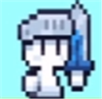|
|2|궁수(archer)|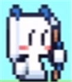|
|3|공격형_마법사(aggressive_wizard)||
|4|지원형_마법사(utility_wizard)||

 

UI  
|연번|오브젝트 이름(영문 이름)|오브젝트 이미지|
|:----:|:----:|:----:|
|5|스테이지별 배경||
|6|재화(gold)||
|7|가방(package)||
|8|보스_타이머(boss_timer)|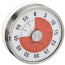|
|9|하단탭 - 성장탭, 플레이어탭, 아이템탭, 상점탭, 보스탭(tab_growth, tab_player, tab_item, tab_store, tab_boss)|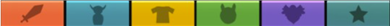|

 

아이템  
|연번|오브젝트 이름(영문 이름)|오브젝트 이미지|
|:----:|:----:|:----:|
|10|폭탄종류 - 빨간색_폭탄, 주황색_폭탄, 노란색_폭탄, 초록색_폭탄, 파란색_폭탄, 남색_폭탄, 보라색_폭탄(boom_red, boom_orange, boom_yellow, boom_green, boom_blue, boom_navy, boom_purple)|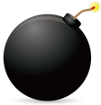|
|11|물약1 종류 - 빨간색_물약1, 노란색_물약1, 보라색_물약1(potion1_red, potion1_yellow, potion1_purple)|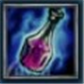|
|12|물약2 종류 - 분홍색_물약2, 연노란색_물약2(potion2_pink, potion2_lightYellow)|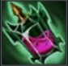|

 

적  
|연번|오브젝트 이름(영문 이름)|오브젝트 이미지|
|:----:|:----:|:----:|
|13|골렘(golem)|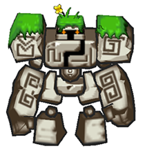|
|14|철_골렘(iron_golem)|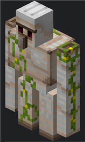|
|15|미니_슬라임(mini_slime)|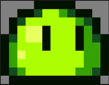|
|16|슬라임(slime)||
|17|나비(butterfly)||
|18|몽환나비(dreamy_butterfly)||
|19|사신(grim_reaper)||
|20|데스킹(king_of_death)|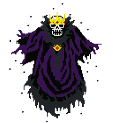|

 

## 2. 파라미터(속성) 뽑아 보기
전사, 궁수, 공격형_마법사  
|속성|영문 명칭|설명|
|:----:|:----:|:----:|
|공격력|attack|적에게 입히는 피해량|
|공격주기|attackRate|적을 공격하는 주기|
|공격범위|attackRange|적을 공격할 수 있는 범위|
|치명타확률|criticalProbability|적에게 치명타 공격할 수 있는 확률|
|치명타피해량|criticalDamage|적에게 치명타 공격을 가했을 시 적에게 입히는 피해량|
|상태|state|캐릭터의 상태|

 

지원형_마법사  
|속성|영문 명칭|설명|
|:----:|:----:|:----:|
|정화주기|debuffRate|아군에게 모든 해로운 효과(쇠약 상태 제외)를 제거하는 주기|
|강화주기|buffRate|아군에게 이로운 효과를 랜덤으로 부여하는 주기|
|상태|state|캐릭터의 상태|

 

배경  
|속성|영문 명칭|설명|
|:----:|:----:|:----:|
|1번 배경|background1|스테이지1, 던전|
|2번 배경|background2|스테이지2, 늪|
|3번 배경|background3|스테이지3, 초원|
|4번 배경|background4|스테이지4, 묘지|

 

## 3. 행동 뽑아 보기
전사, 궁수, 공격형_마법사  
|행동|영문 명칭|설명|
|:----:|:----:|:----:|
|기본|stand|아무 행동하지 않는 모습|
|공격|attackEnemy|공격주기마다 적에게 피해를 입히는 모습|

 

지원형_마법사  
|행동|영문 명칭|설명|
|:----:|:----:|:----:|
|기본|stand|아무 행동하지 않는 모습|
|정화|removeDebuff|정화주기마다 아군에게 모든 해로운 효과(쇠약 상태 제외)를 제거하는 모습|
|무작위 강화|giveBuff|강화주기마다 아군에게 이로운 효과를 랜덤으로 부여하는 모습|

 

철_골렘  
|행동|영문 명칭|설명|
|:----:|:----:|:----:|
|기본|stand|아무 행동하지 않는 모습|
|방어|defendOneself|자신에게 경감효과를 부여하는 모습|

 

슬라임  
|행동|영문 명칭|설명|
|:----:|:----:|:----:|
|기본|stand|아무 행동하지 않는 모습|
|분열|divideOneself|자신이 여러 개로 분열하는 모습|

 

몽환나비  
|행동|영문 명칭|설명|
|:----:|:----:|:----:|
|기본|stand|아무 행동하지 않는 모습|
|분신 소환|summonOneself|자기 분신을 소환하는 모습|

 

데스킹  
|행동|영문 명칭|설명|
|:----:|:----:|:----:|
|기본|stand|아무 행동하지 않는 모습|
|안개 생성|fogCreation|안개를 생성하는 모습|

 

## 4. 상태 뽑아 보기
물약1 종류 - 빨간색_물약1, 노란색_물약1, 보라색_물약1  
|현상태|전이상태|전이조건|
|:----:|:----:|:----:|
|일반 상태|광기 상태|물약1 사용 시|
|광기 상태|일반 상태|물약1 지속 시간이 지났을 시|

 

물약2 종류 - 분홍색_물약2, 연노란색_물약2  
|현상태|전이상태|전이조건|
|:----:|:----:|:----:|
|일반 상태|광기 상태|물약2 사용시|
|광기 상태|쇠약 상태|광기 상태의 지속시간이 지났을 시|
|쇠약 상태|일반 상태|쇠약 상태의 지속시간이 지났을 시|

 

데스킹  
|현상태|전이상태|전이조건|
|:----:|:----:|:----:|
|일반 상태|즉사 1스택 상태|안개 생성 시|
|즉사 1스택 상태|즉사 2스택 상태|안개 생성 시|
|즉사 2스택 상태|행동 불능 상태(즉사 3스택 상태)|안개 생성 시|

 

## 5. 플레이어 캐릭터 속성(파라미터)
|속성|영문명칭|설명|비고|
|:----:|:----:|:----:|:----:|
|전사|wrrior|검, 밸런스형|근거리 공격|
|궁수|archer|활, 스피드형|원거리 공격|
|공격형_마법사|aggressive_wizard|스태프, 파워형|원거리 공격|
|지원형_마법사|utility_wizard|스태프, 지원형|공격하지 않음|

 

## 6. 게임의 규칙
- 노말 스테이지
	- 적의 체력이 0이 되면 보상이 주어지며, 이 보상은 가방에 누적
	- 가방을 클릭 시 노말 스테이지에 대한 보상을 받게 되고 노말 스테이지 1단계로 초기화

- 보스 스테이지
	- (승리 시) 보스 체력을 0이 되면 보상이 주어지며, 이 보상은 자동 수령
	- (패배 시) 보스 타이머가 0이 되면 노말 스테이지로 자동 이동

 

## 7. 게임에서 사용될 공식

- 치명타확률 공식
	- 숫자(1~100)를 무작위로 하나 뽑아
		- 치명타확률보다 같거나 높을 경우, 적에게 공격력에 비례한 치명타피해량 만큼 피해를 입힙니다.
		- 치명타확률보다 낮을 경우, 적에게 공격력만큼 피해를 입힙니다.

- 치명타피해량 공식
	- 치명타피해량 = (기본 치명타피해량(200%) + 능력치로 증가된 치명타피해량) * 물약으로 증가된 치명타피해량

- 경감(피해량 감소) 공식
	- 최종 피해량 = 입히는 피해량 - (입히는 피해량 * 경감(%))
