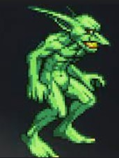
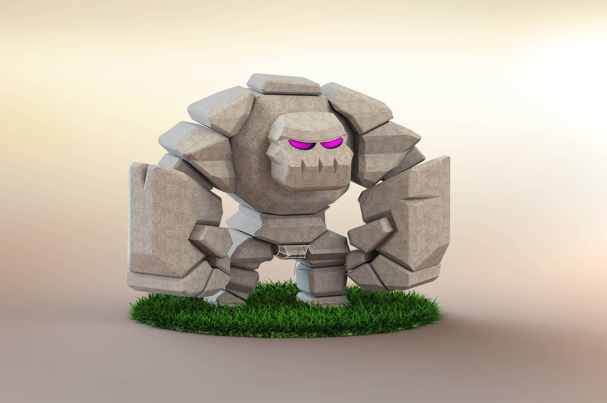

# Boss Rusher(개발자: 장종익)
최근 수정일: 23.04.19

  

# 목차

[게임 개요](#게임-개요)
1. [컨셉](#컨셉)
    - 테마
    - 메인 컨셉
2. [관련 이미지 & 동영상](#관련-이미지--동영상)
    - 관련 게임명
    - 관련 이미지
    - 관련 동영상
3. [대표 이미지](#대표-이미지)  
    - 대표 이미지
4. [컨셉 & 대표 이미지 기반 작품묘사](#컨셉--대표-이미지-기반-작품묘사)  
    - 컨셉 기반
    - 대표 이미지 기반
5. [게임 구성 요소](#게임-구성-요소)
    - 게임 묘사
    - 매커니즘
    - 이야기
    - 미적요소
    - 기술
6. [게임 시스템 디자인](#게임-시스템-디자인)
    - 게임 오브젝트 분해
    - 속성 뽑아 보기
    - 행동 뽑아 보기
    - 상태 뽑아 보기
    - 플레이어 캐릭터 속성
    - 게임 규칙
    - 게임에서 사용될 공식
    - 타이틀 씬
    - 엔딩 씬
    - 이벤트 요소
7. [요구사항](#요구사항)
    - UI
    - 스토리 및 튜토리얼
    - 인게임 시스템
    - 캐릭터
    - 아이템
    - 몬스터
8. [키보드 이벤트에 대한 흐름도](#키보드-이벤트에-대한-흐름도)
9. [스토리보드](#스토리보드)
10. [프로토타입 개발 요구사항(6주 개발)](#프로토타입-개발-요구사항6주-개발)
    - 1주차
    - 2주차
    - 3주차
    - 4주차
    - 5주차
    - 6주차
11. [프로토타입 개발 작업일정(6주 개발)](#프로토타입-개발-작업일정6주-개발)
    - 1주차
    - 2주차
    - 3주차
    - 4주차
    - 5주차
    - 6주차
12. [알파 개발 요구사항(4주 개발)](#알파-개발-요구사항4주-개발)
13. [알파 개발 작업일정(4주 개발)](#알파-개발-작업일정4주-개발)
14. [베타 개발 요구사항(6주 개발)](#베타-개발-요구사항6주-개발)
15. [베타 개발 작업일정(6주 개발)](#베타-개발-작업일정6주-개발)
16. [변경 및 폐기된 아이디어들](#변경-및-폐기된-아이디어들)
17. [고민 중인 사항](#고민-중인-사항)

  

# [게임 개요]

|게임명|Boss Rusher(보스 러셔)|
|:----:|:----:|
|장르|롤플레잉 게임, 방치형 게임|
|플랫폼|모바일|
|제작 엔진|유니티|
|타겟 유저층|직장인, 자영업자|
|플레이 인원|1인|

  

# [컨셉]

## 테마: 복수심은 원동력이 된다. //

- 복수심은 누군가를 이길 때나 자신의 목표를 달성할 때도 동기부여를 주기도 한다.

## 컨셉 1: 성장

- 성장 요소들은 게임 플레이어가 게임을 계속해서 진행하고 게임 캐릭터를 발전시키는 데 동기부여를 제공하며, 게임의 재미와 흥미를 유지 시키는 역할을 한다. 따라서 방치형 게임에서 성장 요소는 매우 중요한 메인 컨셉 중 하나다.

### 컨셉 2: 밸런스

- 캐릭터 성장함에 있어 능력치 분배가 중요한데, 한 능력치가 다른 능력치보다 월등하게 좋으면 대부분의 플레이어가 그 능력치만 성장하기에 각각의 능력치 증가 효율을 비슷하게 제작한다.

  

# [관련 이미지 & 동영상]

## 관련 게임명

- Tap Titans 2

 

## 관련 이미지

- 

 

## 관련 동영상

<video src="https://user-images.githubusercontent.com/101154999/231504708-07de010d-4cac-4731-bb39-fe8ba47400f4.mp4"></video>

  

# [대표 이미지]

## 대표 이미지

- 

  

# [컨셉 & 대표 이미지 기반 작품묘사]

## 컨셉 기반

- //

 

## 대표 이미지 기반

- 배경: 보스 스테이지 몬스터에 관련된 배경을 사용할 예정이다.
- 화면 중앙: 캐릭터, 몬스터, 피해량이 표시될 예정이다.
- 화면 좌측 상단: 설정, 가방이 표시될 예정이다.
- 화면 중앙 상단: 스테이지 정보, 몬스터 HP, 보유 재화가 표시될 예정이다.
- 화면 우측 상단: 보스 타이머가 표시될 예정이다.
- 화면 하단: 하단탭(성장탭, 캐릭터탭, 아이템탭, 상점탭, 보스탭)이 표시될 예정이다.

  

# [게임 구성 요소]

## 1. 게임 묘사

- 전략 성장 

 

## 2. 매커니즘

### 도전 과제

1. 노말 스테이지 클리어
2. 클리어 보상으로 캐릭터 성장
3. 환생 시스템으로 캐릭터 2차 성장
4. 보스 스테이지 클리어

### 재미 요소

- 캐릭터 마다 성장변화가 있어, 이 성장변화를 이용해 게임의 전략적인 측면을 강화한다.
- 보스 마다 패턴이 달라, 이 패턴을 파훼하기 위해 노력하게 된다.
- 보스 난이도가 높을 경우, 여러 번 도전하여 페이즈 별 보상인 훈장을 받아 보스 난이도를 낮출 수 있다.

 

## 3. 이야기

### 제작 배경

- 고등학생 때에 ‘TapTitans’라는 게임을 자주 플레이했었다.
- 그 당시에는 새로운 게임 플레이 요소와 간단한 조작 방법으로 인해 이 게임이 인기를 끌었던 것 같다.
- 하지만 몇 년이 지난 지금, 그 때의 추억이 떠올라 이 게임을 다시 플레이하게 되었다.
- 그러던 중, 이 게임을 만들어보고 싶은 욕구가 생겨났다.

### 참신함

- 캐릭터 성장 변화
	- 능력치가 일정 수치 이상 성장할 경우, 캐릭터의 공격에 추가적인 효과를 부여한다.
	- 이러한 추가적인 효과는 게임의 전략적인 측면을 강화시키는 역할을 하며,
	- 플레이어들은 능력치를 최대한 끌어올려서 이러한 효과를 더욱 활용하고자 한다.

### 카메라 관점

- 카메라 관점은 3인칭으로 제공된다.

 

## 4. 미적요소

### 디자인

- 모든 디자인은 도트로 제작할 예정이다.

### 색상

- 스테이지 별로 보스를 정하고 보스에 관련된 색상으로 배경을 제작한다.

### 음향

- 노말 스테이지의 배경 음악은 밝은 느낌의 음악으로, 보스 스테이지의 배경 음악은 긴장감 넘치는 음악으로 설정한다.

 

## 5. 기술

- 모바일 용으로 개발한다.

  

# [게임 시스템 디자인]

## 1. 게임 오브젝트 분해

캐릭터  

|오브젝트 이름|영문 이름|오브젝트 이미지|
|:----:|:----:|:----:|
|전사|warrior||
|궁수|archer||
|공격형_마법사|aggressive_wizard||
|지원형_마법사|utility_wizard||

UI  

|오브젝트 이름|영문 이름|오브젝트 이미지|
|:----:|:----:|:----:|
|스테이지별 배경|||
|재화|gold||
|가방|package||
|보스_타이머|boss_timer||
|성장탭, 플레이어탭, 아이템탭, 상점탭, 보스탭|tab_growth, tab_haracter, tab_item, tab_store, tab_boss||

아이템  

|오브젝트 이름|영문 이름|오브젝트 이미지|
|:----:|:----:|:----:|
|빨간색_폭탄, 주황색_폭탄, 노란색_폭탄, 초록색_폭탄, 파란색_폭탄, 남색_폭탄, 보라색_폭탄|boom_red, boom_orange, boom_yellow, boom_green, boom_blue, boom_navy, boom_purple||
|빨간색_물약1, 노란색_물약1, 파란색_물약1|potion1_red, potion1_yellow, potion1_blue||
|주황색_물약2, 보라색_물약2|potion2_orange, potion2_purple||

몬스터  

|오브젝트 이름|영문 이름|오브젝트 이미지|
|:----:|:----:|:----:|
|고블린|goblin||
|골렘|golem||
|철_골렘|iron_golem||
|미니_슬라임|mini_slime||
|슬라임|slime||
|나비|butterfly||
|몽환나비|dreamy_butterfly||
|사신|grim_reaper||
|데스킹|king_of_death||

 

## 2. 속성 뽑아 보기

배경  

|속성|오브젝트 이름|영문 이름|설명|
|:----:|:----:|:----:|:----:|
|sprite|던전|background1|스테이지1|
|sprite|늪|background2|스테이지2|
|sprite|초원|background3|스테이지3|
|sprite|묘지|background4|스테이지4|

 

## 3. 행동 뽑아 보기

전사, 궁수, 공격형_마법사  

|행동|영문 명칭|설명|
|:----:|:----:|:----:|
|기본|stand|아무 행동하지 않는 모습|
|공격|attackEnemy|공격주기마다 적에게 피해를 입히는 모습|

지원형_마법사  

|행동|영문 명칭|설명|
|:----:|:----:|:----:|
|기본|stand|아무 행동하지 않는 모습|
|정화|removeDebuff|정화주기마다 아군에게 모든 해로운 효과(쇠약 상태 제외)를 제거하는 모습|
|무작위 강화|giveBuff|강화주기마다 아군에게 이로운 효과를 랜덤으로 부여하는 모습|

철_골렘  

|행동|영문 명칭|설명|
|:----:|:----:|:----:|
|기본|stand|아무 행동하지 않는 모습|
|방어|defendOneself|자신에게 보호막을 부여하는 모습|
|철 소환|summonIron|대상에게 철로 공격하는 모습|

슬라임  

|행동|영문 명칭|설명|
|:----:|:----:|:----:|
|기본|stand|아무 행동하지 않는 모습|
|분열|divideOneself|자신이 여러 개로 분열하는 모습|

몽환나비  

|행동|영문 명칭|설명|
|:----:|:----:|:----:|
|기본|stand|아무 행동하지 않는 모습|
|분신 소환|summonOneself|자기 분신을 소환하는 모습|

데스킹  

|행동|영문 명칭|설명|
|:----:|:----:|:----:|
|기본|stand|아무 행동하지 않는 모습|
|안개 생성|fogCreation|안개를 생성하는 모습|

 

## 4. 상태 뽑아 보기

물약1 종류 - 빨간색_물약1, 노란색_물약1, 파란색_물약1  

|현상태|전이상태|전이조건|
|:----:|:----:|:----:|
|일반 상태|광기 상태|물약1 사용 시|
|광기 상태|일반 상태|물약1 지속 시간이 지났을 시|

물약2 종류 - 주황색_물약2, 보라색_물약2  

|현상태|전이상태|전이조건|
|:----:|:----:|:----:|
|일반 상태|광기 상태|물약2 사용시|
|광기 상태|쇠약 상태|광기 상태의 지속시간이 지났을 시|
|쇠약 상태|일반 상태|쇠약 상태의 지속시간이 지났을 시|

데스킹  

|현상태|전이상태|전이조건|
|:----:|:----:|:----:|
|일반 상태|즉사 1스택 상태|안개 생성 시|
|즉사 1스택 상태|즉사 2스택 상태|안개 생성 시|
|즉사 2스택 상태|행동 불능 상태(즉사 3스택 상태)|안개 생성 시|

 

## 5. 플레이어 캐릭터 속성

전사, 궁수, 공격형_마법사  

|속성|영문 명칭|설명|
|:----:|:----:|:----:|
|float|damage|피해량|
|float|attackRate|공격속도(초당 공격 횟수)|
|int|attackRange|공격범위|
|int|accuracy|적중도|
|int|criticalProbability|치명타 확률|
|float|criticalDamage|치명타 피해량|
|string|state|상태|

지원형_마법사  

|속성|영문 명칭|설명|
|:----:|:----:|:----:|
|float|debuffRate|아군에게 모든 해로운 효과(쇠약 상태 제외)를 제거하는 주기|
|float|buffRate|아군에게 이로운 효과를 랜덤으로 부여하는 주기|
|string|state|캐릭터의 상태|

 

## 6. 게임 규칙

### 노말 스테이지

1-1) 보상 조건  

- 몬스터 체력이 0 이하 시
    - 보상이 자동으로 수령되며, 노말 스테이지 1단계 증가.
    - 더 높은 체력 및 재화를 가진 몬스터를 생성.

1-2) 환생  

- 환생 시
    - 주인공 캐릭터 능력치 증가 및 재화 수령.
    - 노말 스테이지를 1단계로 초기화.

### 보스 스테이지

2-1) 보상 조건  

- '보스 타이머가 0초 혹은 모든 캐릭터가 전투가 불가능할 시' and 몬스터 체력이 70% 이하 시
    - 보상: 기본 보상.
    - 노말 스테이지 이동.
- '보스 타이머가 0초 혹은 모든 캐릭터가 전투가 불가능할 시' and 몬스터 체력이 40% 이하 시
    - 보상: 기본 보상 + 추가 보상1.
    - 노말 스테이지 이동.
- 몬스터 체력이 0% 일 시
    - 보상: 기본 보상 + 추가 보상1 및 추가 보상2.
    - 다음 노말 스테이지 이동.

2-2) 패배 조건  

- 몬스터 체력이 70% 초과 시
    - 보상 없음.
	
 

## 7. 게임에서 사용될 공식

### 치명타확률 공식

- 숫자(1~100)를 무작위로 하나 뽑아
- 치명타확률보다 같거나 높을 경우, 적에게 공격력에 비례한 치명타피해량 만큼 피해를 입힙니다.
- 치명타확률보다 낮을 경우, 적에게 공격력만큼 피해를 입힙니다.

### 치명타피해량 공식

- 치명타피해량 = 피해량 * {(기본 치명타피해량(%) + 능력치로 증가된 치명타피해량(%)) * 물약으로 증가된 치명타피해량(%)} / 100

### 최종피해량 공식

- 최종피해량 = 피해량 * (100 + 대상의 피격 피해량(%) + 폭탄으로 증가된 피해량(%)) / 100

### 공격적중확률 공식

- 공격적중확률 = 적중도 / 회피도 * 100 (단위: %)
- 적중도가 50% 미만이면, 공격 시 1로 표기한다.
- 권장 적정도는 보스 1페이즈 회피도로 표기한다.

 

## 8. 타이틀 씬

- 주인공이 방랑하는 이미지다.

 

## 9. 엔딩 씬

- 주인공과 영입된 캐릭터들이 길을 걸어가는 것을 연출할 예정이다.

 

## 10. 이벤트 요소

- 이스터 에그: 보스가 20번 회피 시, 5초간 약 올리는 이모티콘(메롱)을 사용한다.

  

# [요구사항]

- 모든 수치는 확정이 아니며, 모든 그래픽은 도트로 작성한다.

 

## 1. UI

시작화면  

- 게임을 실행하면 시작화면을 출력한다.
- 시작화면에 중앙 하단에 눌러서 시작하기, 왼쪽 상단에 설정이 있다.

- 시작화면에서 눌러서 시작하기를 누르면 로딩화면을 출력한다.
- 로딩화면 출력 후 게임화면이 출력한다.

- 설정에는 배경음 및 효과음, 게임종료, 계속하기가 있다.
- 배경음 및 효과음은 슬라이드로 조절한다.
- 게임종료 버튼은 연한 빨간색 배경에 흰색 글씨로 설정한다.
- 게임종료 버튼을 누를 경우, 게임이 종료된다.
- 계속하기 버튼을 누를 경우, 설정창이 닫힌다.

로딩화면  

- 로딩화면은 검은 화면으로 출력한다.

게임화면  

- 게임화면의 좌측 상단에 설정, 가방이 있다.
- 게임화면의 중앙 상단에 stage, 몬스터 HP, 보유 중인 재화량이 있다.
- 게임화면의 몬스터 HP 기준 몬스터의 버프창은 하단 좌측이고, 디버프창은 우측 하단이다.
- 게임화면의 중단 기준 플레이어의 버프창은 좌측이고, 디버프창은 우측이다.

- 설정에는 배경음 및 효과음, 게임종료, 계속하기가 있다.
- 배경음 및 효과음은 슬라이드로 조절한다.
- 게임종료 버튼은 연빨간색 배경에 흰색 글씨로 설정한다.
- 게임종료 버튼을 누를 경우, 게임이 종료된다.
- 계속하기 버튼을 누를 경우, 설정창이 닫힌다.

- 가방 버튼을 누를 경우, 가방창이 생성되며, 노말 스테이지가 초기화된다.
- 가방창의 중앙 중단에는 얻은 재화량 및 아이템이 있으며, 중앙 하단에 확인 버튼이 있다.

- 게임화면의 하단에는 탭들이 있다.
- 하단탭을 누를 경우, 창이 생성되며 하단탭의 이미지가 변경된다.
- 모든 하단탭 창의 우측 상단에 아래방향이 있다.
- 아랫방향 버튼을 누를 경우, 하단탭 창이 닫힌다.

- 성장탭 창의 좌측에는 이미지, 중앙에는 이미지의 설명, 우측에는 성장 비용이 있다.
- 성장의 종류로는 공격력, 공격주기, 치명타확률, 치명타피해량이 있다.
- 성장비용 버튼을 누를 경우, 선택한 스탯을 성장한다.

- 캐릭터탭은 미정.

- 아이탬탭 창의 중앙에 얻은 아이템이 있으며 하단에 선택한 아이템의 세부 설명이 출력된다.
- 아이탬탭 창의 좌측 하단에는 선택한 아이탬의 이미지, 중앙 하단에는 이미지의 설명, 우측에는 사용하기가 있다.
- 물약1 또는 물약2를 선택하여 사용하기 버튼을 누를 경우, 플레이어의 버프창에 사용한 물약 이미지가 생성되며 남은 시간이 출력된다.

- 상점탭은 기본적으로 구매탭으로 설정되어 있다.
- 상점탭 창의 상단에는 구매, 판매가 있다.
- 상점탭 창의 중앙에 얻은 아이템이 있으며 하단에 선택한 아이템의 세부 설명이 출력된다.
- 상정탭 창의 좌측 하단은 선택한 아이템 이미지, 중앙에 아이탬의 설명, 우측에는 구매하기/판매하기가 있다.
- 상점탭에는 아이템(물약1) 구매 및 아이템(물약1, 물약2) 판매가 가능하다.

- 보스탭 창은 좌측에는 보스 몬스터 이미지, 중앙에는 보스 몬스터의 설명, 우측에는 이동하기가 있다.
- 이동하기 버튼을 누를 경우, 로딩화면 2초간 출력 후, 보스 스테이지로 이동한다.

- 보스 스테이지 게임화면의 스테이지 표기(Stage 01 -> Boss Stage 01)를 변경한다.
- 보스 스테이지 게임화면에서는 전투퇴장, 타이머가 활성화되며, 가방, 상점탭, 보스탭이 비활성화된다.
- 보스 스테이지 게임화면의 노말 스테이지 몬스터에서 보스 스테이지 몬스터로 변경한다.
- 전투퇴장 버튼을 누를 경우, 전투퇴장 창이 출력된다.
- 전투퇴장 창에는 계속하기, 돌아가기가 있다.
- 계속하기 버튼을 누를 경우, 전투퇴장 창이 닫힌다.
- 돌아가기 버튼을 누를 경우, 전투퇴장 창이 닫힌다.
- 보스 체력이 0이 되면, 전투승리 창이 출력된다.
- 전투승리 창의 중앙에 얻은 금화량, 얻은 아이템, 돌아가기가 있다.
- 다시하기 버튼을 누를 경우, 전투승리 창이 닫히며 로딩화면 2초간 출력 후, 보스 스테이지를 초기화한다.
- 돌아가기 버튼을 누를 경우, 전투승리 창이 닫히며 로딩화면 2초간 출력 후, 노말 스테이지로 이동한다.
- 타이머가 0 이하일 경우, 전투패배 창이 출력된다.
- 전투패배 창의 하단에 다시하기, 돌아가기가 있다.
- 다시하기 버튼을 누를 경우, 전투패배 창이 닫히며 로딩화면 2초간 출력 후, 보스 스테이지를 초기화한다.
- 돌아가기 버튼을 누를 경우, 전투패배 창이 닫히며 로딩화면 2초간 출력 후, 노말 스테이지로 이동한다.

 

## 2. 스토리 및 튜토리얼

- 스토리는 스토리보드를 참조.

 

- 시작화면의 눌러서 시작하기를 처음 눌렀을 경우, 스토리가 시작된다.
- 스토리가 나온 후, 튜토리얼이 실행된다.
- 스토리 및 튜토리얼은 우측 상단의 넘어가기 버튼을 누를 경우, 내용을 보지 않고 다음 화면으로 넘어갈 수 있다.
- 튜토리얼에 사용할 몬스터는 고블린이며, 보스는 고블린 족장이다.
- 튜토리얼을 클리어 시, 소량의 골드를 준다.

- 튜토리얼 설명 순서
  1. 캐릭터의 자동 공격 기능을 설명
  2. 노말 스테이지의 적을 처치 시, 재화가 가방에 적립
  3. 가방을 클릭 시, 노말 스테이지가 초기화되고, 가방 안에 있는 재화를 획득
  4. 획득한 재화로 캐릭터 성장
  5. 아이템 사용
  6. 보스 몬스터과의 전투승리

 

## 3. 인게임 시스템

- 캐릭터가 몬스터를 공격할 경우, 피해량 텍스트 출력한다.
- 기본피해량은 흰색 텍스트를, 치명타피해량은 노란색 텍스트를 출력한다.
- 치명타피해량은 기본피해량의 400%이다.

- 경감은 입는 피해량을 감소시킨다.
- 경감의 최소 단계는 0단계이고 최대 단계는 3단계이다.
- 경감 1단계 당 입는 피해량이 5% 감소된다.
- 경감 수치는 몬스터의 버프창에 출력한다.

- 물약1, 물약2 중첩 사용 불가능하다.
- 물약2는 1차 사용효과의 지속시간이 지나면 2차 사용효과가 자동으로 발동된다.

- 노말 스테이지의 몬스터를 처치 시, 가방에 보상을 적립하며, 노말 스테이지 단계가 증가한다.
- 노말 스테이지를 오를수록, 더 많은 체력 및 보상을 가진 몬스터가 생성된다.
- 노말 스테이지에서 드랍하는 아이템의 종류는 폭탄, 물약1이 드랍된다.

- 보스 스테이지 몬스터를 처치 시 아이템과 재화를 얻는다.
- 보스 스테이지에서 드랍하는 아이템은 난이도에 따라 보상이 달라진다.
- 보스 스테이지의 몬스터로 인한 디버프는 클리어 성공/실패 시 사라진다.

 

## 4. 캐릭터

### 캐릭터 정보

캐릭터 정보  

|캐릭터 종류|공격 타입|공격 범위|공격 대상 수|
|:----:|:----:|:----:|:----:|
|전사|물리 공격|근접 공격|단일 공격|
|궁수|물리 공격|원거리 공격|단일 공격|
|공격형_마법사|마법 공격|원거리 공격|다수 공격|
|지원형_마법사|해당사항 없음|해당사항 없음|해당사항 없음|

캐릭터 기본 스펙  

|캐릭터 종류|공격력|공격속도|치명타확률|치명타피해량|적중도|
|:----:|:----:|:----:|:----:|:----:|:----:|
|전사|400|0.2|0%|200%|0|
|궁수|600|0.14|0%|200%|20|
|공격형_마법사|1000|0.1|0%|200%|40|

|캐릭터 종류|강화수치|강화주기|지속시간|정화주기|
|:----:|:----:|:----:|:----:|:----:|
|지원형_마법사|공격력 20 증가, 치명타피해량 30% 증가|60초|10초|120초|

### 캐릭터 성장

캐릭터 성장 종류 및 수치  

|캐릭터 종류|공격력|공격주기|치명타확률|치명타피해량|적중도|
|:----:|:----:|:----:|:----:|:----:|:----:|
|전사|1 증가|1% 증가|1% 증가(최대 100%)|1% 증가|1 증가|
|궁수|2 증가|1% 증가|1% 증가(최대 100%)|1% 증가|1 증가|
|공격형_마법사|4 증가|1% 증가|1% 증가(최대 100%)|1% 증가|1 증가|

|캐릭터 종류|강화수치|강화주기|정화주기|
|:----:|:----:|:----:|:----:|
|지원형_마법사|공격력 2 증가, 치명타피해량 3% 증가|0.5초 감소(최대 10초 감소)|0.5초 감소(최대 20초 감소)|

캐릭터 성장 소모 비용  

|캐릭터 종류|공격력|공격주기|치명타확률|치명타피해량|적중도|
|:----:|:----:|:----:|:----:|:----:|:----:|
|전사|300 + 10%|300 + 12.5%|500 + 12.5%|300 + 10%|500 + 12.5%|
|궁수|700 + 10%|700 + 12.5%|1,200 + 12.5%|700 + 10%|1,200 + 12.5%|
|공격형_마법사|1,500 + 10%|1,500 + 12.5%|2,000 + 12.5%|1,500 + 10%|2,000 + 12.5%|

|캐릭터 종류|강화수치|강화주기|정화주기|
|:----:|:----:|:----:|:----:|
|지원형_마법사|10,000 + 25%|20,000 + 20%|20,000 + 20%|

### 캐릭터 성장에 따른 변화

|캐릭터 종류|공격력|공격주기|치명타확률|치명타피해량|적중도|
|:----:|:----:|:----:|:----:|:----:|:----:|
|전사|검기 발사(원거리 공격 가능)|일정 횟수마다 2번 공격|해당사항 없음|해당사항 없음|해당사항 없음|
|궁수|일정 횟수마다 추가 피해 입힘|여러 명한테 화살 공격(다수 공격 가능)|해당사항 없음|해당사항 없음|해당사항 없음|
|공격형_마법사|일정 횟수마다 지속 피해 입힘|낮은 확률로 공격 적중 시, 대상 회피도 10% 감소|해당사항 없음|해당사항 없음|해당사항 없음|

|캐릭터 종류|강화수치|강화주기|정화주기|
|:----:|:----:|:----:|:----:|
|지원형_마법사|해당사항 없음|해당사항 없음|해당사항 없음|

### 캐릭터 고용

캐릭터 고용 비용  

|캐릭터 종류|고용 비용|
|:----:|:----:|
|전사|해당사항 없음|
|궁수|50,000|
|공격형_마법사|100,000|
|지원형_마법사|300,000|

 

## 아이템

물약1 종류  

|물약1 색상|사용효과|지속시간|
|:----:|:----:|:----:|
|빨간색|공격력 40 증가|30분|
|노란색|공격속도 25% 증가|30분|
|파란색|치명타피해량 100% 증가|30분|

물약2 종류  

|물약2 색상|1차 사용효과|지속시간|2차 사용효과|지속시간|
|:----:|:----:|:----:|:----:|:----:|
|주황색|공격력의 30% 증가|5분|공격속도 40% 감소|5분|
|보라색|치명타피해량의 40% 증가|5분|치명타확률 0%|5분|

 

## 몬스터

### 골렘

|종류|수치|비고|
|:----:|:----:|:----:|
|체력|1000|1 stage 당 5%|
|금화량|200|1 stage 당 5%|
|아이템 드랍율|5%|10 stage 당 5%, 50 stage 부터 물약2 드랍|

### 철 골렘

- 체력: 25,000  

- 페이즈 별 변경사항  

|명칭|영문 명칭|수치(∽71%/70∽41%/40∽0%)|비고|
|:----:|:----:|:----:|:----:|
|회피도|evasion|20/25/30|해당사항 없음|
|방어|defendOneself|보호막 2,000/4,000/6,000 부여|패턴1|
|염력|summonIron|방향키 0/8/12 입력|패턴2|
- 염력 패턴: 메이플의 구애의 춤

 

- 보상
- 페이즈별 보상은 누적됩니다.  

|명칭|영문 명칭|수치(∽71%/70∽41%/40∽1%/0%)|비고|
|:----:|:----:|:----:|:----:|
|훈장|medal|0/2/3/5|보상1|
|금화량|clearCoin|0/10,0000/15,000/25,000|보상2|

### 슬라임

- 체력 재생 효과
- 체력 0% 이하 시 분열

### 몽환나비

- 비행 오브젝트
- 체력 50% 이하 시 분신 소환(본체가 죽으면 분신도 죽음)

### 데스킹

- 즉사 스킬을 사용하는 오브젝트

  

# [키보드 이벤트에 대한 흐름도]

캐릭터는 자동으로 공격하며, UI는 터치 방식으로 작동한다.

  

# [스토리보드]

우뚝 솟은 산맥의 그늘에 자리 잡고 조용하고 평화로운 삶을 사는 작은 마을이 있었다.

어느 날, 고블린 무리가 마을에 왔을 때 그 평화로움은 산산조각이 났다. 고블린 무리가 눈에 보이는 모든 것을 약탈하고 파괴하기 시작하였다. 집들은 불타고, 농작물은 짓밟히고, 가축은 도살되었다.

혼란 속에서 주인공은 고블린 무리의 위협에 정면으로 맞서기 위해 나섰다. 주인공은 끝이 없어 보이는 고블린 무리를 가르면서 다 죽여갔을 때, 어둠 속에서 한 사람의 모습이 나타났다. 눈 앞에 고블린 족장이 있었다.

그는 고블린 족장을 보자 맞서 싸웠다. 그의 검이 휘익 소리를 내며, 고블린 족장의 몸에 깊은 상처를 가했다. 마침내 주인공은 고블린 족장에게 치명타를 입혔다. 고블린 족장이 치명상을 입은 상태로 누워 있을 때, 그는 숨을 헐떡이며 마지막 숨을 내쉬었다.

"왜 내 마을을 공격했지?" 그가 물었다.

"데스킹이 마을을 공격하라고 했어. 그는 우리에게 음식과 보물을 약속했고, 인간들은 약하다고 말했어.” 고블린 족장이 쉰 목소리로 말한 후, 서서히 숨소리가 약해져 갔다.

고블린 족장이 숨소리가 멎을 것을 확인하고, 주인공은 생명의 흔적을 찾아 헤맸다. 그러나 그들이 발견한 것은 고통과 공포로 얼굴이 일그러진 마을 사람들의 시체와 고블린 무리의 시체가 있었다.

주인공은 무거운 마음으로 마을을 빠져나와 탁 트인 길로 나아갔다. 그들은 마음속에 목적지도, 따라갈 뚜렷한 길도 없었다. 그가 아는 것은 더 이상 이 장소에 머물 수 없다는 것이었다.

그는 복수심을 가득 품은 채, 방랑하게 된다.

  

# [프로토타입 개발 요구사항(6주 개발)]

## 1주차

### 게임화면 UI 제작

- ~~배경화면을 제작한다.~~
- ~~설정, 가방, 스테이지, 적 체력, 재화, 타이머를 제작한다.~~
- ~~하단탭(성장탭, 캐릭터탭, 아이템탭, 상점탭, 보스탭)을 제작한다.~~
- ~~게임화면의 좌측 상단에 설정, 가방이 있다.~~
- ~~게임화면의 중앙 상단에 stage, 몬스터 HP, 보유 중인 재화량이 있다.~~
- ~~게임화면의 하단에는 탭들이 있다.~~

 

## 2주차

### 게임화면 UI 버튼 상호작용 구현

- ~~설정에는 배경음 및 효과음, 게임종료, 계속하기가 있다.~~
- ~~배경음 및 효과음은 슬라이드로 조절한다.~~
- ~~게임종료 버튼은 연빨간색 배경에 흰색 글씨로 설정한다.~~
- ~~게임종료 버튼을 누를 경우, 게임이 종료된다.~~
- ~~계속하기 버튼을 누를 경우, 설정창이 닫힌다.~~

- ~~가방창의 중앙 중단에는 얻은 재화량 및 아이템이 있으며, 중앙 하단에 확인 버튼이 있다.~~

- ~~하단탭을 누를 경우, 창이 생성되며 하단탭의 이미지가 변경된다.~~
- ~~모든 하단탭 창의 우측 상단에 아래방향이 있다.~~
- ~~아랫방향 버튼을 누를 경우, 하단탭 창이 닫힌다.~~

 

## 3주차

### 오브젝트 구현

- ~~전사 캐릭터의 stand 상태를 구현한다.~~
- ~~1 스테이지 골렘, 철 골렘의 stand 상태를 구현한다.~~

- ~~보스탭 창은 좌측에는 보스 몬스터 이미지, 중앙에는 보스 몬스터의 설명, 우측에는 전투하기가 있다.~~
- ~~전투하기 버튼을 누를 경우, 로딩화면 2초간 출력 후, 보스 스테이지로 이동한다.~~
- ~~로딩화면은 검은 화면으로 출력한다.~~
- ~~보스 스테이지 게임화면의 스테이지 표기(Stage 01 -> Boss Stage 01)를 변경한다.~~
- ~~보스 스테이지 게임화면에서는 전투퇴장, 타이머가 활성화되며, 가방, 상점탭, 보스탭이 비활성화된다.~~
- ~~보스 스테이지 게임화면의 노말 스테이지 몬스터에서 보스 스테이지 몬스터로 변경한다.~~
- ~~전투퇴장 버튼을 누를 경우, 전투퇴장 창이 출력된다.~~
- ~~전투퇴장 창에는 계속하기, 돌아가기가 있다.~~
- ~~계속하기 버튼을 누를 경우, 전투퇴장 창이 닫힌다.~~
- ~~돌아가기 버튼을 누를 경우, 전투퇴장 창이 닫힌다.~~

 

## 4주차

### 공격 시스템 구현

- ~~전사 캐릭터의 attack 상태를 구현한다.~~
- ~~전사 캐릭터는 5초마다 공격한다.~~
- ~~캐릭터가 몬스터를 공격할 경우, 피해량 텍스트 출력한다.~~

- ~~노말 스테이지의 몬스터를 처치 시, 가방에 보상을 적립하며, 노말 스테이지 단계가 증가한다.~~
- ~~노말 스테이지를 오를수록, 더 많은 체력 및 보상을 가진 몬스터가 생성된다.~~

- 1 스테이지 철 골렘의 defendOneself 상태를 구현한다.
- ~~철 골렘의 방어 상태는 60초마다 사용한다.~~

- ~~보스 체력이 0이 되면, 전투승리 창이 출력된다.~~
- ~~전투승리 창의 중앙에 얻은 금화량, 얻은 아이템, 돌아가기가 있다.~~
- ~~다시하기 버튼을 누를 경우, 전투승리 창이 닫히며 로딩화면 2초간 출력 후, 보스 스테이지를 초기화한다.~~
- ~~돌아가기 버튼을 누를 경우, 전투승리 창이 닫히며 로딩화면 2초간 출력 후, 노말 스테이지로 이동한다.~~
- ~~타이머가 0 이하일 경우, 전투패배 창이 출력된다.~~
- ~~전투패배 창의 하단에 다시하기, 돌아가기가 있다.~~
- ~~다시하기 버튼을 누를 경우, 전투패배 창이 닫히며 로딩화면 2초간 출력 후, 보스 스테이지를 초기화한다.~~
- ~~돌아가기 버튼을 누를 경우, 전투패배 창이 닫히며 로딩화면 2초간 출력 후, 노말 스테이지로 이동한다.~~

 

## 5주차

### 아이템 시스템 구현

- ~~기본피해량은 흰색 텍스트를, 치명타피해량은 노란색 텍스트를 출력한다.~~
- ~~치명타피해량은 기본피해량의 400%이다.~~

- ~~성장탭 창의 좌측에는 이미지, 중앙에는 이미지의 설명, 우측에는 성장 비용이 있다.~~
- ~~성장의 종류로는 공격력, 공격주기, 치명타확률, 치명타피해량이 있다.~~
- ~~성장비용 버튼을 누를 경우, 선택한 스탯을 성장한다.~~
- ~~공격주기의 최대 레벨은 30레벨이고, 치명타확률의 최대 레벨은 100 레벨이다.~~
- ~~치명타확률은 숫자(1~100)를 무작위로 하나 뽑아 치명타확률보다 같거나 높을 경우, 적에게 공격력에 비례한 치명타피해량 만큼 피해를 입힙니다.~~
- ~~치명타확률은 숫자(1~100)를 무작위로 하나 뽑아 치명타확률보다 낮을 경우, 적에게 공격력 만큼 피해를 입힙니다.~~

- ~~아이탬탭 창의 중앙에 얻은 아이템이 있으며 하단에 선택한 아이템의 세부 설명이 출력된다.~~
- ~~아이탬탭 창의 좌측 하단에는 선택한 아이탬의 이미지, 중앙 하단에는 이미지의 설명, 우측에는 사용하기가 있다.~~
- ~~물약1 또는 물약2를 선택하여 사용하기 버튼을 누를 경우, 플레이어의 버프창에 사용한 물약 이미지가 생성되며 남은 시간이 출력된다.~~

- ~~게임화면의 중단 기준 플레이어의 버프창은 좌측이고, 디버프창은 우측이다.~~
- ~~물약1, 물약2 중첩 사용 불가능하다.~~
- ~~물약2는 1차 사용효과의 지속시간이 지나면 2차 사용효과가 자동으로 발동된다.~~
- ~~물약1은 30분간 버프를 부여한다.~~
- ~~물약1의 종류는 공증, 공주감, 치증이 있다.~~
- ~~물약2는 5분간 버프를 부여한 후, 5분간 디버프를 부여한다.~~
- ~~물약2의 종류는 공증공주증, 치증치확0이 있다.~~

- ~~상점탭은 기본적으로 구매탭으로 설정되어 있다.~~
- ~~상점탭 창의 상단에는 구매, 판매가 있다.~~
- ~~상점탭 창의 중앙에 얻은 아이템이 있으며 하단에 선택한 아이템의 세부 설명이 출력된다.~~
- ~~상정탭 창의 좌측 하단은 선택한 아이템 이미지, 중앙에 아이템의 설명, 우측에는 구매하기/판매하기가 있다.~~
- ~~상점탭에는 아이템(물약1) 구매 및 아이템(물약1, 물약2) 판매가 가능하다.~~

- ~~노말 스테이지 몬스터를 처치 시 낮은 확률로 아이템을 드랍한다.~~
- ~~노말 스테이지가 높아질수록 아이템 드랍율 및 재화가 증가한다.~~

- ~~보스 스테이지 몬스터를 처치 시 아이템과 재화를 드랍한다.~~

 

## 6주차

### 저장 시스템 구현

- ~~게임을 실행하면 시작화면을 출력한다.~~
- ~~시작화면에 중앙 하단에 눌러서 시작하기, 왼쪽 상단에 설정이 있다.~~
- ~~시작화면에서 눌러서 시작하기를 누르면 로딩화면을 출력한다.~~
- ~~로딩화면 출력 후 게임화면이 출력한다.~~
- ~~설정에는 배경음 및 효과음, 게임종료, 계속하기가 있다.~~
- ~~배경음 및 효과음은 슬라이드로 조절한다.~~
- ~~게임종료 버튼은 연한 빨간색 배경에 흰색 글씨로 설정한다.~~
- ~~게임종료 버튼을 누를 경우, 게임이 종료된다.~~
- ~~계속하기 버튼을 누를 경우, 설정창이 닫힌다.~~
- 노말 스테이지 보스와 보스 스테이지의 사운드를 다르게 설정한다.
- ~~UI 클릭 사운드를 추가한다.~~
- ~~전사 캐릭터 attack 상태 사운드를 추가한다.~~
- ~~저장 시스템 구현한다.~~

  

# [프로토타입 개발 작업일정(6주 개발)]

## <U>영상길이를 짧게 제작하기 위해 인게임 수치는 조정하였습니다.</U> 

----------------------------------------------------------------------------------

## 1주차 작업일정

### 게임화면 UI 제작

[요구사항]

- 배경화면을 제작한다.(100%)
- 설정, 가방, 스테이지, 적 체력, 재화, 타이머를 제작한다.(100%)
- 하단탭(성장탭, 캐릭터탭, 아이템탭, 상점탭, 보스탭)을 제작한다.(100%)
- 게임화면의 좌측 상단에 설정, 가방이 있다.(100%)
- 게임화면의 중앙 상단에 stage, 몬스터 HP, 보유 중인 재화량이 있다.(100%)
- 게임화면의 하단에는 탭들이 있다.(100%)

[작업내용]

- 게임화면 UI 제작(100%)

### 제작 결과

 

## 2주차 작업일정

### 게임화면 UI 버튼 상호작용 구현

[요구사항]

- 설정에는 배경음 및 효과음, 게임종료, 계속하기가 있다.(100%)
- 배경음 및 효과음은 슬라이드로 조절한다.(50%)
- 게임종료 버튼은 연빨간색 배경에 흰색 글씨로 설정한다.(100%)
- 게임종료 버튼을 누를 경우, 게임이 종료된다.(100%)
- 계속하기 버튼을 누를 경우, 설정창이 닫힌다.(100%)

- 가방창의 중앙 중단에는 얻은 재화량 및 아이템이 있으며, 중앙 하단에 확인 버튼이 있다.(100%)

- 하단탭을 누를 경우, 창이 생성되며 하단탭의 이미지가 변경된다.(50%)
- 모든 하단탭 창의 우측 상단에 아래방향이 있다.(100%)
- 아랫방향 버튼을 누를 경우, 하단탭 창이 닫힌다.(100%)

[작업내용]

- 설정 구현(70%)
- 가방 구현(100%)
- 하단탭 구현(70%)

### 제작 결과

<video src="https://user-images.githubusercontent.com/101154999/199627728-b430c022-1b4f-4b07-b3e4-f29c54e5616f.mp4"></video>

 

## 3주차 작업일정

### 게임화면 UI 버튼 상호작용 구현(2주차 미구현)

[요구사항]

- 배경음 및 효과음은 슬라이드로 조절한다.(100%)
- 하단탭을 누를 경우, 창이 생성되며 하단탭의 이미지가 변경된다.(100%)

[작업내용]

- 설정 구현(100%)
- 하단탭 구현(100%)

### 오브젝트 구현(3주차)

[요구사항]

- 전사 캐릭터의 stand 상태를 구현한다.(100%)
- 1 스테이지 골렘, 철 골렘의 stand 상태를 구현한다.(0%)

- 보스탭 창은 좌측에는 보스 몬스터 이미지, 중앙에는 보스 몬스터의 설명, 우측에는 전투하기가 있다.(100%)
- 전투하기 버튼을 누를 경우, 로딩화면 2초간 출력 후, 보스 스테이지로 이동한다.(100%)
- 로딩화면은 검은 화면으로 출력한다.(100%)
- 보스 스테이지 게임화면의 스테이지 표기(Stage 01 -> Boss Stage 01)를 변경한다.(100%)
- 보스 스테이지 게임화면에서는 전투퇴장, 타이머가 활성화되며, 가방, 상점탭, 보스탭이 비활성화된다.(100%)
- 보스 스테이지 게임화면의 노말 스테이지 몬스터에서 보스 스테이지 몬스터로 변경한다.(0%)
- 전투퇴장 버튼을 누를 경우, 전투퇴장 창이 출력된다.(100%)
- 전투퇴장 창에는 계속하기, 돌아가기가 있다.(100%)
- 계속하기 버튼을 누를 경우, 전투퇴장 창이 닫힌다.(100%)
- 돌아가기 버튼을 누를 경우, 전투퇴장 창이 닫힌다.(100%)

[작업내용]

- 오브젝트 stand 상태 구현(30%)
- 보스 스테이지 이동 구현(100%)

### 제작 결과

<video src="https://user-images.githubusercontent.com/101154999/222303448-cb87c1be-0541-477c-b93e-bddd89991983.mp4"></video>

 

## 4주차 작업 일정

### 오브젝트 구현(3주차 미구현)

[요구사항]

- 1 스테이지 골렘, 철 골렘의 stand 상태를 구현한다.(100%)

- 보스 스테이지 게임화면의 노말 스테이지 몬스터에서 보스 스테이지 몬스터로 변경한다.(100%)

[작업내용]

- 오브젝트 stand 상태 구현(100%)
- 보스 스테이지 이동 구현(100%)

###  공격 시스템 구현(4주차)

[요구사항]

- 전사 캐릭터의 attack 상태를 구현한다.(100%)
- 전사 캐릭터는 5초마다 공격한다.(100%)
- 캐릭터가 몬스터를 공격할 경우, 피해량 텍스트 출력한다.(100%)

- 노말 스테이지의 몬스터를 처치 시, 가방에 보상을 적립하며, 노말 스테이지 단계가 증가한다.(100%)
- 노말 스테이지를 오를수록, 더 많은 체력 및 보상을 가진 몬스터가 생성된다.(100%)

- 1 스테이지 철 골렘의 defendOneself 상태를 구현한다.(0%)
- 철 골렘의 방어 상태는 60초마다 사용한다.(0%)

- 보스 체력이 0이 되면, 전투승리 창이 출력된다.(100%)
- 전투승리 창의 중앙에 얻은 금화량, 얻은 아이템, 돌아가기가 있다.(100%)
- 다시하기 버튼을 누를 경우, 전투승리 창이 닫히며 로딩화면 2초간 출력 후, 보스 스테이지를 초기화한다.(100%)
- 돌아가기 버튼을 누를 경우, 전투승리 창이 닫히며 로딩화면 2초간 출력 후, 노말 스테이지로 이동한다.(100%)
- 타이머가 0 이하일 경우, 전투패배 창이 출력된다.(100%)
- 전투패배 창의 하단에 다시하기, 돌아가기가 있다.(100%)
- 다시하기 버튼을 누를 경우, 전투패배 창이 닫히며 로딩화면 2초간 출력 후, 보스 스테이지를 초기화한다.(100%)
- 돌아가기 버튼을 누를 경우, 전투패배 창이 닫히며 로딩화면 2초간 출력 후, 노말 스테이지로 이동한다.(100%)

[작업내용]

- 오브젝트 패턴 구현(50%)
- 노말 스테이지 시스템 구현(100%)
- 보스 스테이지 전투승리/전투패배 화면 구현(100%)

### 제작 결과

<video src="https://user-images.githubusercontent.com/101154999/222304397-41bb99ce-9616-4d9c-8060-c6aa91042c37.mp4"></video>

 

## 5주차 작업 일정

###  공격 시스템 구현(4주차 미구현)

[요구사항]

- 1 스테이지 철 골렘의 defendOneself 상태를 구현한다.(0%)
- 철 골렘의 방어 상태는 60초마다 사용한다.(100%)

[작업내용]

-  오브젝트 패턴 구현(50%)

### 아이템 시스템 구현(5주차)

[요구사항]

- 기본피해량은 흰색 텍스트를, 치명타피해량은 노란색 텍스트를 출력한다.(100%)
- 치명타피해량은 기본피해량의 400%이다.(100%)

- 성장탭 창의 좌측에는 이미지, 중앙에는 이미지의 설명, 우측에는 성장 비용이 있다.(100%)
- 성장의 종류로는 공격력, 공격주기, 치명타확률, 치명타피해량이 있다.(100%)
- 성장비용 버튼을 누를 경우, 선택한 스탯을 성장한다.(100%)
- 공격주기의 최대 레벨은 30레벨이고, 치명타확률의 최대 레벨은 100 레벨이다.(100%)
- 치명타확률은 숫자(1~100)를 무작위로 하나 뽑아 치명타확률보다 같거나 높을 경우, 적에게 공격력에 비례한 치명타피해량 만큼 피해를 입힙니다.(100%)
- 치명타확률은 숫자(1~100)를 무작위로 하나 뽑아 치명타확률보다 낮을 경우, 적에게 공격력 만큼 피해를 입힙니다.(100%)

- 아이탬탭 창의 중앙에 얻은 아이템이 있으며 하단에 선택한 아이템의 세부 설명이 출력된다.(100%)
- 아이탬탭 창의 좌측 하단에는 선택한 아이탬의 이미지, 중앙 하단에는 이미지의 설명, 우측에는 사용하기가 있다.(100%)
- 물약1 또는 물약2를 선택하여 사용하기 버튼을 누를 경우, 플레이어의 버프창에 사용한 물약 이미지가 생성되며 남은 시간이 출력된다.(0%)

- 게임화면의 중단 기준 플레이어의 버프창은 좌측이고, 디버프창은 우측이다.(0%)
- 물약1, 물약2 중첩 사용 불가능하다.(100%)
- 물약2는 1차 사용효과의 지속시간이 지나면 2차 사용효과가 자동으로 발동된다.(100%)
- 물약1은 30분간 버프를 부여한다.(100%)
- 물약1의 종류는 공증, 공주감, 치증이 있다.(100%)
- 물약2는 5분간 버프를 부여한 후, 5분간 디버프를 부여한다.(100%)
- 물약2의 종류는 공증공주증, 치증치확0이 있다.(100%)

- 상점탭은 기본적으로 구매탭으로 설정되어 있다.(0%)
- 상점탭 창의 상단에는 구매, 판매가 있다.(0%)
- 상점탭 창의 중앙에 얻은 아이템이 있으며 하단에 선택한 아이템의 세부 설명이 출력된다.(0%)
- 상정탭 창의 좌측 하단은 선택한 아이템 이미지, 중앙에 아이템의 설명, 우측에는 구매하기/판매하기가 있다.(0%)
- 상점탭에는 아이템(물약1) 구매 및 아이템(물약1, 물약2) 판매가 가능하다.(0%)

- 노말 스테이지 몬스터를 처치 시 낮은 확률로 아이템을 드랍한다.(0%)
- 노말 스테이지가 높아질수록 아이템 드랍율 및 재화가 증가한다.(0%)

- 보스 스테이지 몬스터를 처치 시 아이템과 재화를 드랍한다.(0%)

[작업내용]

- 성장탭, 아이템탭, 상점탭 구현(60%)
- 아이템(물약1, 물약2) 및 버프창 구현(10%)
- 보상 시스템 구현(0%)

### 제작 결과

<video src="https://user-images.githubusercontent.com/101154999/222304334-9193fe89-b3e7-4ff8-8c5d-29618668463e.mp4"></video>

 

## 6주차 작업 일정

### 공격 시스템 구현(4주차 미구현)

[요구사항]

- 1 스테이지 철 골렘의 defendOneself 상태를 구현한다.(0%)

[작업내용]

-  오브젝트 패턴 구현(50%)

### 아이템 시스템 구현(5주차 미구현)

[요구사항]

- 물약1 또는 물약2를 선택하여 사용하기 버튼을 누를 경우, 플레이어의 버프창에 사용한 물약 이미지가 생성되며 남은 시간이 출력된다.(100%)

- 게임화면의 중단 기준 플레이어의 버프창은 좌측이고, 디버프창은 우측이다.(100%)

- 상점탭은 기본적으로 구매탭으로 설정되어 있다.(100%)
- 상점탭 창의 상단에는 구매, 판매가 있다.(100%)
- 상점탭 창의 중앙에 얻은 아이템이 있으며 하단에 선택한 아이템의 세부 설명이 출력된다.(100%)
- 상정탭 창의 좌측 하단은 선택한 아이템 이미지, 중앙에 아이템의 설명, 우측에는 구매하기/판매하기가 있다.(100%)
- 상점탭에는 아이템(물약1) 구매 및 아이템(물약1, 물약2) 판매가 가능하다.(100%)

- 노말 스테이지 몬스터를 처치 시 낮은 확률로 아이템을 드랍한다.(100%)
- 노말 스테이지가 높아질수록 아이템 드랍율 및 재화가 증가한다.(100%)

- 보스 스테이지 몬스터를 처치 시 아이템과 재화를 드랍한다.(100%)

[작업내용]

- 아이템(물약2) 구현(100%)
- 상점탭 구현(100%)
- 보상 시스템 구현(100%)

### 저장 시스템 구현(6주차)

[요구사항]

- 게임을 실행하면 시작화면을 출력한다.(100%)
- 시작화면에 중앙 하단에 눌러서 시작하기, 왼쪽 상단에 설정이 있다.(100%)
- 시작화면에서 눌러서 시작하기를 누르면 로딩화면을 출력한다.(100%)

- 2초간 로딩화면 출력 후 게임화면이 출력한다.(100%)

- 설정에는 배경음 및 효과음, 게임종료, 계속하기가 있다.(100%)
- 배경음 및 효과음은 슬라이드로 조절한다.(100%)
- 게임종료 버튼은 연한 빨간색 배경에 흰색 글씨로 설정한다.(100%)
- 게임종료 버튼을 누를 경우, 게임이 종료된다.(100%)
- 계속하기 버튼을 누를 경우, 설정창이 닫힌다.(100%)

- 시작화면의 사운드를 추가한다.(0%)
- 보스 스테이지의 사운드를 추가한다.(0%)
- 전사 캐릭터 attack 상태 사운드를 추가한다.(100%)
- UI 클릭 사운드를 추가한다.(100%)

- 저장 시스템 구현한다.(100%)

[작업내용]

- 화면 전환(100%)
- 사운드 추가(60%)
- 저장 시스템 구현(100%)

### 제작 결과

<video src="https://user-images.githubusercontent.com/101154999/219369623-69287220-386b-4a19-b5c8-94a5231a5976.mp4"></video>

 

# [알파 개발 요구사항(4주 개발)]

- 알파

- 7주차 4
- 게임 시스템 변경

- 8주차 5
- 1스테이지 보스 몬스터 구현

- 9주차 6
- 2스테이지 몬스터 및 이동 구현
- 2스테이지 캐릭터 구현

- 10주차 7
- 2스테이지 보스 몬스터 구현

- 베타

- 11주차 9
- 3스테이지 몬스터 및 이동 구현
- 3스테이지 캐릭터 구현

- 12주차 10
- 3스테이지 보스 구현

- 13주차 11
- 4스테이지 몬스터 및 이동 구현
- 4스테이지 캐릭터 구현

- 14주차 12
- 4스테이지 보스 구현

- 15주차 13
- 폭탄 아이템 구현

- 16주차 14
- 튜토리얼 

# [알파 개발 작업일정(4주 개발)]

## 7주차 작업일정

### 게임 시스템 변경(7주차)

[요구사항]

- 스테이지 클리어 시, 보상 자동 수령으로 변경한다.(100%)
- 가방 시스템을 환생 시스템으로 변경한다.(100%)
- 환생 시, 스테이지 마다 확률적으로 포션을 드랍하고, 10 스테이지 마다 전사 캐릭터 공격력 1이 증가한다.(100%)
- 환생 창은 상단부터 환생, 환생 설명, 변경사항, 좌측 하단에는 환생하기 버튼, 우측 하단에는 돌아가기 버튼이 있다.(100%)
- 환생하기 버튼을 누를 경우, 환생 조건(최소 20스테이지) 충족 시, 변경사항들이 적용된다.(100%)
- 환생하기 버튼을 누를 경우, 환생 조건 미충족 시, 창이 닫히며 환생 미충족 알림이 뜨게 설정한다.(100%)
- 돌아가기 버튼을 누를 경우, 창이 닫힌다.(100%)

- 환생 밑에 캐릭터 능력치 창을 추가한다.(100%)
- 캐릭터 능력치에는 캐릭터 능력치에 대한 정보, 우측 상단에 설명 버튼이 있다.(100%)
- 캐릭터 능력치 창에서 검은색은 기본 능력치 + 성장 능력치, 보라색은 환생 추가 능력치, 초록색은 버프 수치, 빨간색은 디버프 수치다.(70%)
- 캐릭터 능력치 창에는 캐릭터 능력치 정보에 대한 설명, 아래애는 확인 버튼이 있다.(100%)
- 캐릭터 능력치 적중도를 추가한다.(70%)
- 보스 회피도 추가한다.(100%)

- 공격주기(타당 공격 시간(5s) + 공격시간(-0.1s))에서 공격속도(초당 공격 횟수(0.2) + 공격속도 1%(0.002))로 변경한다.(100%)
- 노란색 물약 텍스트 표기 및 사용 효과 변경한다(공격시간 0.5초 감소 -> 공격속도 20% 증가).(100%)

- 금화의 테두리를 어두운 노란색에서 갈색으로 변경한다.(100%)

[작업내용]

- 가방 시스템 -> 환생 시스템 변경(100%)
- 캐릭터 능력치 정보 구현(90%)
- 캐릭터 적중도 추가(70%)
- 보스 회피도 추가(100%)
- 공격주기 -> 공격속도 변경(100%)
- 금화 이미지 개선(100%)

### 제작 결과

 

## 8주차 작업일정

### 게임 시스템 변경(7주차)

[요구사항]

- 캐릭터 능력치 창에서 검은색은 기본 능력치 + 성장 능력치, 보라색은 환생 추가 능력치, 초록색은 버프 수치, 빨간색은 디버프 수치다.(100%)
- 캐릭터 능력치 적중도를 추가한다.(100%)

[작업내용]

- 캐릭터 능력치 정보 구현(100%)
- 캐릭터 적중도 추가(100%)

### 1 스테이지 보스 몬스터 구현1(8주차)

[요구사항]

- 캐릭터 성장탭 창에서 전체 캐릭터 능력치가 아닌 성장된 능력치로 나오게 변경한다.(100%)
	- 수정 전: 캐릭터 기본 스탯 + 성장 수치 * 레벨 -> 캐릭터 기본 스탯 + 성장 수치 * (레벨 + 1)
	- 수정 후: 성장 수치 * 레벨 -> 성장 수치 * (레벨 + 1)
- 플레이어의 캐릭터가 몬스터를 공격 시 피격모션으로 빨갛게 변하게 한다.(100%)
- 경감 중첩 당 피격 피해량 5% 감소를 구현한다.(100%)

- 보스 패턴은 30초 이후 첫 패턴, 1분 마다 랜덤으로 패턴을 사용한다.(100%)

- 보호막 패턴의 애니메이션을 추가한다.(0%)
- 패턴 시, 보호막을 부여한다.(100%)
- 중앙에 30초의 시간제한이 표기한다.(100%)
- 보호막은 모든 피해를 흡수한다.(100%)
- 시간제한 내에 보호막을 파괴 시, 10초간 피격 피해량 10% 증가한다.(100%)
- 몬스터 디버프 창에 피격 피해량 증가 표기한다.(100%)
- 시간제한 내에 보호막을 파괴하지 못할 시, 보호막은 유지된 상태로 경감이 1스택이 중첩된다.(100%)
- 몬스터 버프창에 경감상태를 표기한다.(100%)

[작업내용]

- 몬스터 피격모션 제작(100%)
- 1 스테이지 보스 몬스터 보호막 패턴 구현(80%)

### 제작 결과

 

## 9주차 작업일정

### 1 스테이지 보스 몬스터 방향키 패턴 구현(8주차)

- 보호막 패턴의 애니메이션을 추가한다.(0%) ----- vv

[작업내용]

- 1 스테이지 보스 몬스터 보호막 패턴 구현(80%)

### 1 스테이지 보스 몬스터 방향키 패턴 구현(9주차)

[요구사항]

- 배경 이미지를 개선한다.(100%)
- 플레이어 버프창, 디버프창 위치를 개선한다.(100%)
- 보스 패턴 타이머 위치를 개선한다.(100%)

- 성장 시스템(피해량, 공격속도, 치명타확률, 치명타피해량, 적중도) 이미지를 개선한다.(100%)

- 환생 시스템 및 캐릭터 정보 시스템 이미지 제작한다.(0%) ----- vv

- 피격 피해량 증가 이미지를 제작한다.(100%)
- 피격 피해량 감소 이미지를 제작한다.(100%)
- 기절상태 애니메이션을 제작한다.(100%)

- 중앙에 30초의 시간제한이 표기한다.(100%)
- 하단 부분에 방향키가 생기며, 상단에 입력할 방향키를 랜덤으로 생성한다.(100%)
- 패턴 중 플레이어의 캐릭터들은 공격을 멈춘다.(100%)
- 입력할 방향키 맞을 경우, 방향키 이미지가 사라진다.(100%)
- 입력할 방향키 틀린 경우, 입력할 방향키가 초기화되며, 플레이어의 캐릭터가 2초간 기절상태가 된다.(100%)
- 시간제한 내에 성공 시, 10초간 피격 피해량 10% 증가한다.(100%)
- 몬스터 디버프 창에 피격 피해량 증가 표기한다.(100%)
- 시간제한 초과 시, 플레이어의 캐릭터가 5초간 기절상태가 된다.(100%)
- 플레이어의 디버프에 기절상태를 표기한다.(0%) ----- vv
- 패턴 종료 시, 하단 부분의 방향키는 사라진다.(100%)

[작업내용]

- 시스템 이미지 제작 및 개선
- 버프창 이미지 제작
- 1 스테이지 보스 몬스터 방향키 패턴 구현

### 제작 결과

 

## 10주차 작업일정

### 스크립트 정리(10주차)

[요구사항]

- 시작화면의 사운드를 추가한다.
- 보스 스테이지의 사운드를 추가한다.

- 스크립트 정리한다.

[작업내용]

- 사운드 추가
- 스크립트 정리

 

  

# [변경 및 폐기된 아이디어들]

## 가방 시스템

가방 -> 환생 시스템 변경

## 폭탄

### 인게임 시스템 설명

- 폭탄의 재사용 대기시간은 30초다.
- 폭탄 시작위치는 전사 캐릭터 기준이다.
- 도착위치는 바닥에 있는 오브젝트 위치 또는 비행 중인 오브젝트 위치 총 2가지다.
- 폭탄은 대상 하나에게 피해를 입힌다.
- 폭탄은 2차함수로 이동하며 회전한다.

### 폭탄 종류

|폭탄 색상|사용 효과|지속시간|비고|디버프 표시|
|:----:|:----:|:----:|:----:|:----:|
|빨간색|몬스터의 체력 재생 0으로 변경한다.|15초간|해당사항 없음|표시|
|주황색|몬스터의 받는 피해량 10% 증가한다.|10초간|해당사항 없음|표시|
|노란색|몬스터를 기절 상태로 만든다.|3초간|모든 공격이 치명타 적용, 비행 중인 몬스터는 추락한다.|표시|
|초록색|||||
|파란색|몬스터의 보호막 파괴한다.|해당사항 없음|해당사항 없음|미표시|
|남색|몬스터에게 ??의 피해를 입힌다.|해당사항 없음|모든 캐릭터의 공격력에 비례한 피해를 입힌다.|미표시|
|보라색|몬스터의 방어도를 낮춘다.|해당사항 없음|경감 1단계를 내린다.|미표시|

# [고민 중인 사항]

- 몬스터 피격 모션으로 투명도가 변경하는 방식
- 몬스터 처치 모션으로 몬스터 크기가 작아지는 방식 + 공격 불가능
- 캐릭터 능력치 성장에 따른 이펙트 변화
- 몬스터 처치 애니메이션 추가
- 성장함에 따라 캐릭터의 외형이 변경 or 이펙트를 추가
- 미국 숫자 단위 변경(ex. 1k = 1,000, 1M = 1,000,000)
- 캐릭터의 스탯 약점 공격 및 몽환나비의 회피율 추가
- 1명 공격하는 캐릭터를 위해 공격 대상 지정

- 보스 방향키 애니메이션 추가할지?
- 보스 몬스터 패턴 1초 전에 대사를 출력할지?
